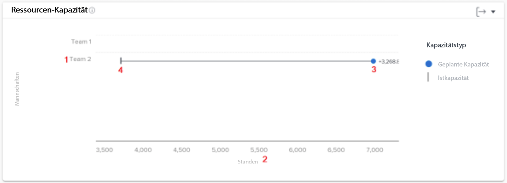
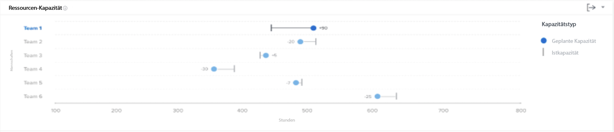

# Das Diagramm zur Ressourcenkapazität in [!UICONTROL Verbesserte Analytics]

Das Diagramm Ressourcenkapazität zeigt die Anzahl der geplanten Stunden, die einem Heimteam innerhalb des gefilterten Zeitraums zugewiesen wurden, in Bezug auf die insgesamt verfügbaren Stunden des Teams.

Dieser Vergleich kann Ihnen dabei helfen festzustellen, ob Sie dem Team nicht genügend Arbeit zuweisen oder ob bei ihnen möglicherweise ein hoher Arbeitsaufwand auftritt. Klicken Sie auf einen Teamnamen, und es wird ein Diagramm zur Teamkapazität mit weiteren Details zur Teamkapazität für den gefilterten Zeitraum angezeigt.

Anhand dieser Informationen können Sie Folgendes feststellen:

* Wenn ein Heimteam überzugewiesen oder nicht zugewiesen wurde.
* Welche Heimteams stehen zur Arbeit zur Verfügung.

Im Diagramm sehen Sie die folgenden Schlüsseldetails:

1. Die Namen der Heimteams sind links.
1. Stunden sind am unteren Ende. Dies ist die X-Achse des Diagramms und berechnet den in den oben aufgeführten Teams angezeigten Stundenbereich.
1. Der Kreis zeigt die Anzahl der geplanten Stunden an, die der Startseite zugewiesen sind.
1. Die vertikale Zeile zeigt die Gesamtanzahl der Stunden an, die für das Startseiten-Team verfügbar sind.

## Verwendung der Grafik

Sie müssen Filter hinzufügen und einen Datumsbereich auswählen, um Daten in den Diagrammen im [!UICONTROL Verbesserte Analyse] Gebiet von Workfront. Wenn Sie zuvor Filter hinzugefügt haben, sind diese aktiv, bis Sie sie entfernen.

Im Diagramm &quot;Ressourcenkapazität&quot;haben Sie folgende Möglichkeiten:

* Bewegen Sie den Mauszeiger über die Startseite, um zu sehen, wie viele Stunden noch geplant werden können, wie viele Stunden das Startseiten-Team voraussichtlich abschließen wird und wie viele Stunden insgesamt gearbeitet wurden (gekennzeichnet als &quot;over&quot;, &quot;under&quot;oder &quot;kapazität&quot;).
* Exportieren Sie die Diagrammdaten mithilfe der Exportschaltfläche oben rechts im Diagramm.
* Klicken Sie auf den Namen des Startseiten-Teams, um das Diagramm zur Teamkapazität zu öffnen. Wenn Sie auf einen kleineren Zeitrahmen im Diagramm zur Teamkapazität hineinzoomen, werden die Daten aktualisiert, die im Diagramm Ressourcenkapazität angezeigt werden.
