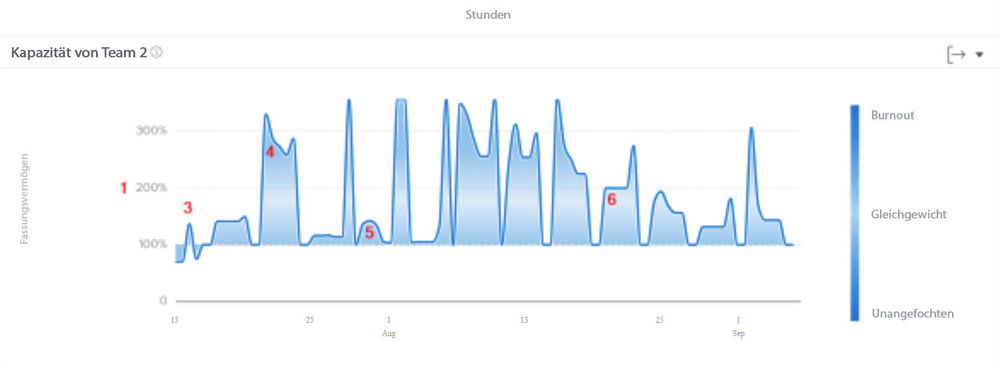
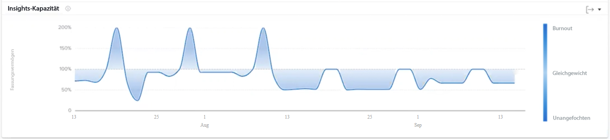

# Grundlegendes zur Team-Kapazität

Das Team-Kapazitäts-Diagramm zeigt an, wann ein Stamm-Team überlastet und wann es nicht ausgelastet war. Das Diagramm zeigt das Arbeitsvolumen an, das dem Stamm-Team an einem bestimmten Tag zugewiesen war, und weist eine dunklere blaue Farbe zu, wenn sich Team-Mitglieder der Überlastung nähern oder aber nicht ausreichend gefordert werden. Eine hellere, transparentere Farbe zeigt an, dass die Arbeitslast eher ausgeglichen ist.

Anhand dieser Informationen können Sie Folgendes feststellen:

* Wann das Stamm-Team überlastet oder nicht ausgelastet war.
* Ob das Stamm-Team auf täglicher Basis überlastet oder nicht ausgelastet ist.
* Wie konsistent die Arbeitslast eines Stamm-Teams von Tag zu Tag ist.
* Ob Sie mit neuen Arbeitsaufträgen Kapazitätsprobleme schaffen.

Im Diagramm sehen Sie Folgendes:

1. Der Prozentsatz der Kapazität des Stamm-Teams ist links zu sehen.
1. Die Datumsangaben unten stammen aus dem ausgewählten Datumsbereich.
1. Die stärker dunkelblaue Füllfarbe zeigt an, dass das Stamm-Team entweder überlastet (4) oder unterfordert ist.
1. Das hellere oder transparentere Blau zeigt an, dass die Arbeitslast des Stamm-Teams ausgeglichen ist

## Wie Sie zum Diagramm navigieren

1. Klicken Sie auf die Registerkarte [!UICONTROL Personen] im linken Bedienfeld.
1. Verwenden Sie den [!UICONTROL Filter], um ein oder mehrere Stamm-Teams zu untersuchen.
1. Daraufhin wird das Diagramm zur Teamkapazität angezeigt.

## Verwendung des Diagramms

Um Daten in den Diagrammen im Abschnitt „Personen“ des Analysebereichs anzuzeigen, müssen Sie Filter hinzufügen und einen Datumsbereich auswählen. Wenn Sie zuvor Filter hinzugefügt haben, bleiben diese aktiv, bis Sie sie entfernen.

Im Team-Kapazitäts-Diagramm haben Sie folgende Möglichkeiten:

* Bewegen Sie den Mauszeiger über einen Punkt im Diagramm, um die Datumszeile anzuzeigen.
* Bewegen Sie den Mauszeiger über einen Punkt auf der Diagrammlinie, um die geplanten Stunden für das vorliegende Datum und den Kapazitätsprozentsatz anzuzeigen und zu sehen, und ob die Auslastung des internen Teams zu dem Zeitpunkt über, unter oder bei seiner Kapazität lag.
* Zoomen Sie in Datumsangaben ein, indem Sie mit der Maus auf einen bestimmten Punkt des Projekts klicken und diesen ziehen. (Mit dieser Aktion werden auch alle anderen Diagramme aktualisiert, und es wird in denselben Datumsbereich eingezoomt.)
* Exportieren Sie die Diagrammdaten mit der Exportschaltfläche oben rechts im Diagramm.
