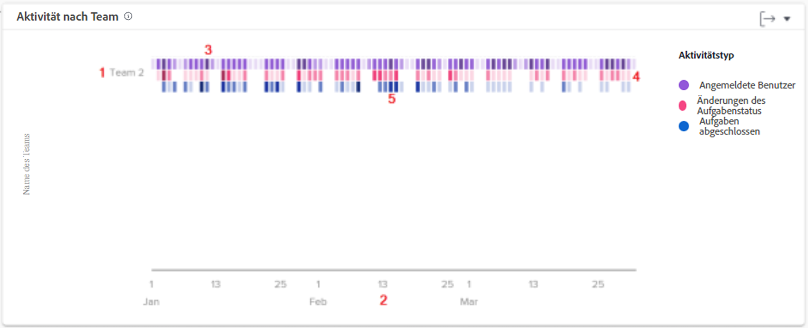

# Informationen zu Arbeits- und Mitarbeiterdiagrammen

Arbeitsdiagramme zeigen Aktivitäten auf Projekt- und Aufgabenebene an, während das Mitarbeiterdiagramm Aktivitäten aus der Perspektive eines Stamm-Teams zeigt.

Wählen Sie im Menü des linken Bedienfelds den Typ der Analysediagramme aus, die Sie anzeigen möchten – Arbeits- oder Mitarbeiterdiagramme.

## Arbeitsdiagramme

![Ein Bild der Suche nach [!UICONTROL Analyse]-Funktionen in [!DNL Workfront Classic]](assets/section-1-1.png)

In den Arbeitsdiagrammen sehen Sie standardmäßig Folgendes:

1. KPI-Statistiken
1. Flugplan
1. Projektaktivität
1. Projekt-Treemap (oben nicht angezeigt)

Der Burndown und die Aufgaben in den Flugdiagrammen werden angezeigt, wenn Sie einen Daten-Drilldown durchführen.

* Klicken Sie in der Flugplan-Ansicht auf ein Projekt, um darunter eine Burndown-Ansicht dieses Projekts anzuzeigen.
* Klicken Sie in der Treemap-Ansicht auf ein Projekt, um darunter einen Burndown sowie die Aufgaben in der Flugansicht anzuzeigen.

## Mitarbeiterdiagramm – Aktivität nach Team

Im Diagramm sehen Sie Folgendes:

1. Namen der Stamm-Teams auf der linken Seite.
1. Die Datumsangaben unten stammen aus dem ausgewählten Datumsbereich.
1. Lila Kästchen zeigen an, dass sich die dem Projekt zugewiesenen Personen an diesem Tag angemeldet haben, wobei ein dunklerer Farbton eine höhere Anzahl von angemeldeten Personen anzeigt.
1. Rosafarbene Kästchen zeigen an, dass Personen den Status einer Aufgabe für das Projekt an diesem Tag geändert haben, wobei ein dunklerer Farbton eine höhere Anzahl von Aufgabenstatusänderungen anzeigt.
1. Blaue Kästchen zeigen an, dass die Personen eine Aufgabe für das Projekt abgeschlossen haben, wobei ein dunklerer Farbton eine höhere Anzahl abgeschlossener Aufgaben anzeigt.

