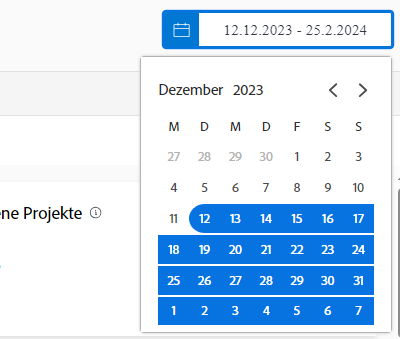

# Grundlegendes zu Datumsbereichen und Zeitrahmen

Beim Anzeigen der [!DNL Enhanced analytics]-Diagramme werden Datumsbereiche mithilfe des Kalender-Widgets angegeben. Die Zeitrahmen werden innerhalb eines Diagramms erstellt. Durch Klicken und Ziehen können Sie einen bestimmten Bereich definieren. So können Sie einzoomen und die Informationen während dieses Zeitraums genauer betrachten.

## Datumsbereiche

Klicken Sie einfach auf ein Datum im Kalender, um ein Datum in Ihrem Bereich anzugeben, und klicken Sie dann auf ein Datum, um das andere Ende des Bereichs anzugeben. Verwenden Sie die Pfeile oben im Kalender, um zu einem anderen Monat zu navigieren, wenn Ihr Start- und Enddatum nicht im selben Monat liegen.

Die Diagramme in [!DNL Analytics] zeigen standardmäßig Daten für die letzten 60 Tage und die nächsten 15 Tage an. Sie können einen neuen Datumsbereich auswählen und ihn auf alle Diagramme anwenden, während Sie [!DNL Analytics] verwenden.

Wenn Sie die Seite aktualisieren, von ihr weg navigieren oder sich von Workfront abmelden/anmelden, wird der Datumsbereich auf den Standardwert zurückgesetzt.

## Zeitrahmen

Klicken Sie auf einen gewünschten Bereich einer Zeitleiste und ziehen Sie ihn umher, um einen Zeitrahmen-Filter zu erstellen. Dieser Zeitrahmen gilt nun für alle Diagramme im Arbeitsbereich und wird neben allen anderen Filtern in der Filterleiste angezeigt. Sie können ein Diagramm genauer betrachten, indem Sie auf Bereiche klicken und diese verschieben, um den Zeitrahmen zu aktualisieren. Um den Zeitrahmen-Filter zu entfernen, bewegen Sie einfach den Mauszeiger in der Filterleiste darüber und klicken Sie auf das X, das angezeigt wird.

Wenn Sie die Seite aktualisieren, von ihr weg navigieren oder sich von Workfront abmelden, wird der Zeitrahmen entfernt und der Datumsbereich zurückgesetzt.

>[!NOTE]
>
>Sie können diese Zeitrahmen-Option nicht mit dem Projekt-Treemap-Diagramm verwenden.
