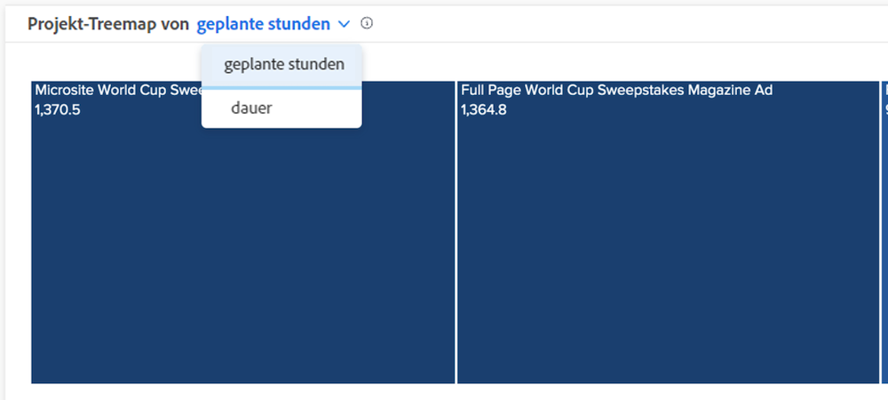

# Grundlegendes zu den Ansichten „Geplante Stunden“ und „Dauer“

In den Burndown- und Projekt-Treemap-Diagrammen können Sie Informationen nach geplanten Stunden oder Dauer anzeigen, abhängig davon, was Sie für Ihre Workfront-Umgebung als genauer erachten.

Die Standardeinstellung ist „Geplante Stunden“. Wenn Sie zu „Dauer“ wechseln, bleibt diese Auswahl beim Verlassen von und Zurückkehren zu [!DNL Analytics] und zwischen Workfront-Anmeldungen erhalten.

## Welche Bedeutung haben die Größe der Kästchen und Farbschattierungen?

Kleinere, hellblaue Kästchen stehen für weniger Stunden, größere Kästchen und dunklere Blauschattierungen im Vergleich dazu für mehr Stunden. Weitere Informationen finden Sie unter [Grundlegendes zur Treemap-Visualisierung eines Projekts](https://experienceleague.adobe.com/docs/workfront/using/reporting/enhanced-analytics/project-treemap-overview.html?lang=de).
