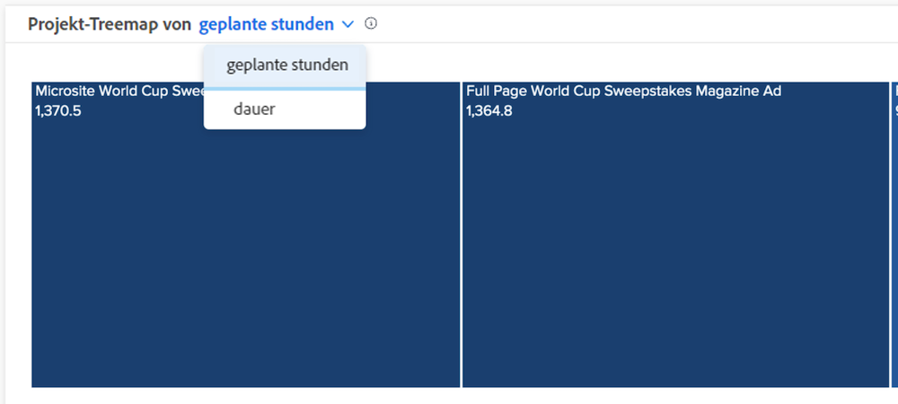

# Grundlegendes zu geplanten Stunden- und Daueransichten in [!UICONTROL Verbesserte Analytics]

In den Diagrammen für die Verteilung und die Projekt-Treemap können Sie die Informationen nach geplanten Stunden oder Dauer anzeigen, je nachdem, was Sie für Ihre Workfront-Umgebung genauer halten.

Die Standardeinstellung ist &quot;Geplante Stunden&quot;. Wenn Sie zu &quot;Dauer&quot;wechseln, bleibt dies bei der Navigation von [!DNL Analytics] und zurück und zwischen Workfront-Anmeldungen.
