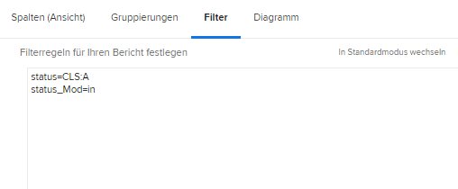

# Grundlegendes zum Textmodus für Filter

In diesem Video erfahren Sie:

* Textmodus
* Was für ein Kamel ist
* Grundlegender Textmodus &quot;Plug-and-Play&quot;, den Sie in Ihren Berichtsfiltern verwenden können

>[!VIDEO](https://video.tv.adobe.com/v/336820/?quality=12)

Im folgenden Textmodus werden Aufgaben ausgeschlossen, bei denen ein Benutzer &quot;Fertig mit My Part&quot;markiert hat. Sie müssen lediglich einen Aufgabenfilter erstellen, beliebige Filterregeln hinzufügen, dann in den Textmodus wechseln und den unten stehenden Code nach einem beliebigen Textmodus einfügen, der im Filter angezeigt wird.

```
EXISTS:1:$$OBJCODE=ASSGN  
EXISTS:1:taskID=FIELD:ID  
EXISTS:1:status=DN  
EXISTS:1:status_Mod=notin  
EXISTS:1:assignedToID=$$USER.ID 
```

## Aktivität: Textmodusfragen

1. Wie würden Sie die Binnenmajuskel-Schreibweise für das Feld &quot;Eingegeben von ID&quot;schreiben?
1. Erstellen Sie in einem Problembericht einen Filter, um Probleme anzuzeigen, die als geschlossen gekennzeichnet wurden, aber noch nicht genehmigt wurden.

## Antworten

1. Die Binnenmajuskeln-Schreibweise für das Feld &quot;Eingegeben von ID&quot; sollte wie folgt geschrieben werden: signedByID
1. Der Textmodus sollte im Filter für Problemberichte wie folgt aussehen:

   
