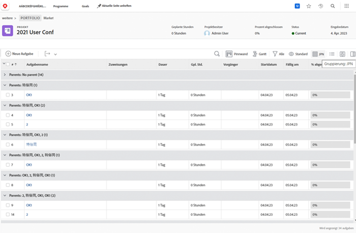
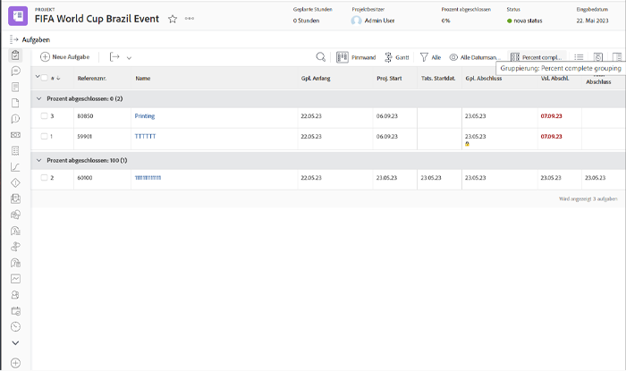
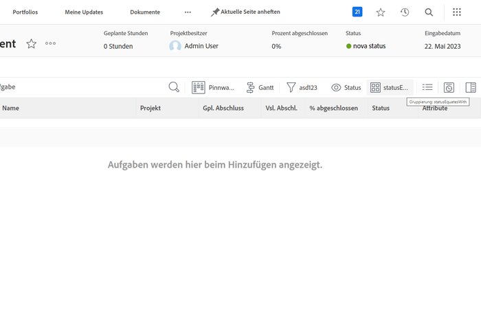
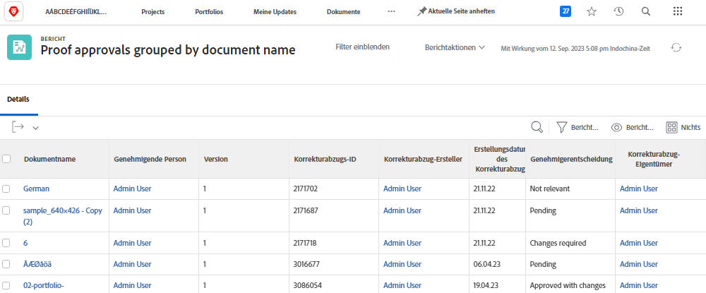

# Grundlegendes zum einfachen Textmodus für Gruppierungen

>[!PREREQUISITES]
>
>* [Grundlegendes zu Reporting-Elementen](https://experienceleague.adobe.com/docs/workfront-learn/tutorials-workfront/reporting/basic-reporting/reporting-elements.html?lang=de)
>* [Grundlegendes zu Reporting-Komponenten](https://experienceleague.adobe.com/docs/workfront-learn/tutorials-workfront/reporting/basic-reporting/reporting-components.html?lang=de)
>* [Eine einfache Gruppierung erstellen](https://experienceleague.adobe.com/docs/workfront-learn/tutorials-workfront/reporting/basic-reporting/create-a-basic-grouping.html?lang=de)


>[!TIP]
>
>* Um ein tieferes Verständnis des Textmodus zu erhalten, empfehlen wir Ihnen, sich die einstündige Aufzeichnung des folgenden Webinars anzusehen: [Experten fragen – Einführung in die Berichterstellung zum Textmodus](https://experienceleague.adobe.com/de/docs/events/classics/reporting-and-dashboards/introduction-to-text-mode-reporting).
>* Um mehr über den Textmodus zu erfahren, sollten Sie sich die Tutorials [Erweiterte Berichterstellung](https://experienceleague.adobe.com/docs/workfront-learn/tutorials-workfront/reporting/advanced-reporting/welcome-to-advanced-reporting.html?lang=de) ansehen, die insgesamt fünfeinhalb Stunden lang sind.
>* Klicken Sie hier, um auf den [[!UICONTROL API-Explorer]](https://developer.adobe.com/workfront/api-explorer/) zuzugreifen

In diesem Video lernen Sie Folgendes:

* Was der Textmodus ist
* Was die Binnenmajuskel-Schreibweise ist
* Einige _Code-Blöcke für den Textmodus_, die Sie in Berichtsgruppierungen verwenden können

>[!VIDEO](https://video.tv.adobe.com/v/3470788/?quality=12&learn=on&captions=ger)

## Aktivitäten: Grundlegendes zum einfachen Textmodus für Gruppierungen

### Aufgabe – Gruppierung nach vier übergeordneten Elementen

Im folgenden Textmodus werden Aufgaben basierend auf bis zu vier Ebenen von übergeordneten Elementen gruppiert, wobei nicht vorhandene übergeordnete Elemente leer gelassen werden.

```
textmode=true
group.0.name=Parents
group.0.valueexpression=CONCAT({parent}.{parent}.{parent}.{parent}.{name},IF(ISBLANK({parent}.{parent}.{parent}.{parent}.{name}),"",", "),{parent}.{parent}.{parent}.{name},IF(ISBLANK({parent}.{parent}.{parent}.{name}),"",", "),{parent}.{parent}.{name},IF(ISBLANK({parent}.{parent}.{name}),"",", "),IF(ISBLANK({parent}.{name}),"No parent",{parent}.{name}))
group.0.linkedname=parent
group.0.namekeyargkey.0=parent
group.0.namekeyargkey.1=name
group.0.valueformat=string
```




### Aufgabe – Gruppierung nach „Prozent abgeschlossen“

Der folgende Textmodus gruppiert Aufgaben danach, wie weit sie prozentual abgeschlossen sind. Aufgaben fallen bei der Gruppierung in eine der folgenden Kategorien:

* 0%
* 1 bis 25 %
* 26 bis 50 %
* 51 bis 75 %
* 76 bis 99 %
* 100%

```
group.0.linkedname=direct
group.0.namekey=percentComplete
group.0.valueexpression=IF({percentComplete}<1,"0%",IF({percentComplete}<26,"1% to 25%",IF({percentComplete}<51,"26% to 50%",IF({percentComplete}<76,"51% to 75%",IF({percentComplete}<100,"76% to 99%",IF({percentComplete}=100,"100","***"))))))
group.0.valueformat=doubleAsString
textmode=true
```



### Aufgabe – statusEquatesWith, dann Status

Im folgenden Textmodus werden Aufgaben nach „statusEquatesWith“ und dann nach Status gruppiert.

```
group.0.enumclass=com.attask.common.constants.TaskStatusEnum
group.0.enumtype=TASK
group.0.linkedname=direct
group.0.name=State
group.0.type=enum
group.0.valuefield=statusEquatesWith
group.0.valueformat=val
group.1.enumclass=com.attask.common.constants.TaskStatusEnum
group.1.enumtype=TASK
group.1.linkedname=direct
group.1.namekey=status
group.1.type=enum
group.1.valuefield=status
group.1.valueformat=val
textmode=true
```




### Korrekturabzug-Genehmigung – Nach Projektname gruppieren

```
group.0.valueformat=HTML
group.0.valuefield=documentVersion:document:project:name
group.0.displayname=Project Name
```


### Korrekturabzugs-Genehmigungen – Nach Dokumentname gruppieren

```
group.0.displayname=Document Name
group.0.valuefield=documentVersion:document:name
group.0.valueformat=HTML
```



