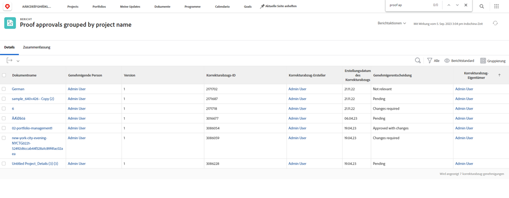

# Grundlegendes zum Textmodus für Gruppierungen

>[!IMPORTANT]
>
>Voraussetzungen:
>
>* Berichterstellungselemente
>* Berichtkomponenten verstehen
>* Basisgruppierung erstellen


>[!TIP]
>
>* Um ein tieferes Verständnis des Textmodus zu erhalten, empfehlen wir, sich das aufgezeichnete Webinar-Ereignis anzusehen [Experten fragen - Einführung in die Berichterstellung zum Textmodus](https://experienceleague.adobe.com/docs/workfront-events/events/reporting-and-dashboards/introduction-to-text-mode-reporting.html?lang=en), die eine Stunde lang ist.
>* Um mehr über den Textmodus zu erfahren, sollten Sie die [Erweiterte Berichterstellung](https://experienceleague.adobe.com/docs/workfront-learn/tutorials-workfront/reporting/advanced-reporting/welcome-to-advanced-reporting.html?lang=en) Tutorials, die zusammen fünfeinhalb Stunden lang sind.


In diesem Video erfahren Sie:

* Textmodus
* Was für ein Kamel ist
* Grundlegender &quot;Plug-and-Play&quot;-Textmodus, den Sie in Ihren Gruppierungen verwenden können

>[!VIDEO](https://video.tv.adobe.com/v/3410641/?quality=12&learn=on)

## Aufgabe - Gruppierung von vier übergeordneten Elementen

Im folgenden Textmodus werden Aufgaben basierend auf bis zu vier Ebenen von Eltern gruppiert und nicht vorhandene Eltern leer gelassen.

```
textmode=true
group.0.name=Parents
group.0.valueexpression=CONCAT({parent}.{parent}.{parent}.{parent}.{name},IF(ISBLANK({parent}.{parent}.{parent}.{parent}.{name}),"",", "),{parent}.{parent}.{parent}.{name},IF(ISBLANK({parent}.{parent}.{parent}.{name}),"",", "),{parent}.{parent}.{name},IF(ISBLANK({parent}.{parent}.{name}),"",", "),IF(ISBLANK({parent}.{name}),"No parent",{parent}.{name}))
group.0.linkedname=parent
group.0.namekeyargkey.0=parent
group.0.namekeyargkey.1=name
group.0.valueformat=string
```


## Aufgabe - Prozentuale vollständige Gruppierung

Im folgenden Textmodus werden Aufgaben basierend auf ihrem prozentualen Abschluss gruppiert. Aufgaben werden in eine der folgenden Kategorien eingeteilt, wenn sie gruppiert sind:

* 0%
* 1 % bis 25 %
* 26 % bis 50 %
* 51 % bis 75 %
* 76 % bis 99 %
* 100%

```
group.0.linkedname=direct
group.0.namekey=percentComplete
group.0.valueexpression=IF({percentComplete}<1,"0%",IF({percentComplete}<26,"1% to 25%",IF({percentComplete}<51,"26% to 50%",IF({percentComplete}<76,"51% to 75%",IF({percentComplete}<100,"76% to 99%",IF({percentComplete}=100,"100","***"))))))
group.0.valueformat=doubleAsString
textmode=true
```


## Task - statusEquatesWith, dann status

Im folgenden Textmodus werden Aufgaben nach statusEquatesWith und dann nach Status gruppiert.

```
group.0.enumclass=com.attask.common.constants.TaskStatusEnum
group.0.enumtype=TASK
group.0.linkedname=direct
group.0.name=State
group.0.type=enum
group.0.valuefield=statusEquatesWith
group.0.valueformat=val
group.1.enumclass=com.attask.common.constants.TaskStatusEnum
group.1.enumtype=TASK
group.1.linkedname=direct
group.1.namekey=status
group.1.type=enum
group.1.valuefield=status
group.1.valueformat=val
textmode=true
```


## Validierungsversuch - Gruppe nach Projektname

```
group.0.valueformat=HTML
group.0.valuefield=documentVersion:document:project:name
group.0.displayname=Project Name
```




## Validierungsversuch - Gruppieren nach Dokumentname

```
group.0.displayname=Document Name
group.0.valuefield=documentVersion:document:name
group.0.valueformat=HTML
```


