# Grundlegendes zum Textmodus für Ansichten


>[!PREREQUISITES]
>
>* [Grundlegendes zu Reporting-Elementen](https://experienceleague.adobe.com/docs/workfront-learn/tutorials-workfront/reporting/basic-reporting/reporting-elements.html?lang=de)
>* [Grundlegendes zu Reporting-Komponenten](https://experienceleague.adobe.com/docs/workfront-learn/tutorials-workfront/reporting/basic-reporting/reporting-components.html?lang=de)
>* [Erstellen einer einfachen Ansicht](https://experienceleague.adobe.com/docs/workfront-learn/tutorials-workfront/reporting/basic-reporting/create-a-basic-view.html?lang=de)


>[!TIP]
>
>* Um ein tieferes Verständnis des Textmodus zu erhalten, empfehlen wir Ihnen, sich die einstündige Aufzeichnung des folgenden Webinars anzusehen: [Experten fragen – Einführung in die Berichterstellung zum Textmodus](https://experienceleague.adobe.com/docs/workfront-events/events/reporting-and-dashboards/introduction-to-text-mode-reporting.html?lang=de).
>* Um mehr über den Textmodus zu erfahren, sollten Sie sich die Tutorials [Erweiterte Berichterstellung](https://experienceleague.adobe.com/docs/workfront-learn/tutorials-workfront/reporting/advanced-reporting/welcome-to-advanced-reporting.html?lang=de) ansehen, die insgesamt fünfeinhalb Stunden lang sind.
>* Klicken Sie hier, um auf den [[!UICONTROL API-Explorer]](https://developer.adobe.com/workfront/api-explorer/) zuzugreifen

In diesem Video lernen Sie Folgendes:

* Was der Textmodus ist
* Was die Binnenmajuskel-Schreibweise ist
* Einige _Textmodus-Codeblöcke_ die Sie in Ihren Berichtsansichten verwenden können

>[!VIDEO](https://video.tv.adobe.com/v/3422888/?quality=12&learn=on&captions=ger)

## Aktivitäten: Grundlegendes zum einfachen Textmodus für Ansichten

### Aufgabe – Ansicht mit 4 übergeordneten Elementen

Erstellen Sie zunächst eine Spalte für den Aufgabennamen und den übergeordneten Namen und verwenden Sie dann den folgenden Textmodus, um die anderen drei Spalten zu erstellen.

#### Aufgabe – Übergeordnetes Element des übergeordneten Namens

```
displayname=Parent of Parent Name
linkedname=parent
namekey=view.relatedcolumn
namekeyargkey.0=parent
namekeyargkey.1=name
querysort=parent:parent:name
textmode=true
valuefield=parent:parent:name
valueformat=HTML
```

#### Aufgabe – Übergeordnetes Element des übergeordneten Elements des übergeordneten Namens

```
displayname=Parent of Parent of Parent Name
linkedname=parent
namekey=view.relatedcolumn
namekeyargkey.0=parent
namekeyargkey.1=name
querysort=parent:parent:parent:name
textmode=true
valuefield=parent:parent:parent:name
valueformat=HTML
```

#### Aufgabe – Übergeordnetes Element des übergeordneten Elements des übergeordneten Elements des übergeordneten Namens

```
displayname=Parent of Parent of Parent of Parent Name
linkedname=parent
namekey=view.relatedcolumn
namekeyargkey.0=parent
namekeyargkey.1=name
querysort=parent:parent:parent:parent:name
textmode=true
valuefield=parent:parent:parent:parent:name
valueformat=HTML
```

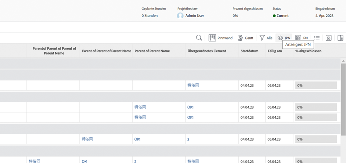

### Benutzer – Iterationen, die Listen in Benutzeransichten anzeigen

#### Benutzer – Alle Aufgabengebiete

```
displayname=All job roles
listdelimiter=<p>
listmethod=nested(userRoles).lists
textmode=true
type=iterate
valuefield=role:name
valueformat=HTML
```

#### Benutzer – Alle Aufgabengebiete, die primäre zeigen

```
displayname=All Job Roles showing primary
listdelimiter=<p> 
listmethod=nested(userRoles).lists 
textmode=true
type=iterate 
valueexpression=IF({user}.{roleID}={role}.{ID},CONCAT("** ",{role}.{name}," **"),{role}.{name})
valueformat=HTML
```

#### Benutzer – Alle Teams

```
displayname=All teams
listdelimiter=<p>
listmethod=nested(teams).lists
textmode=true
type=iterate
valueexpression={name}
valueformat=HTML
```

>[!NOTE]
>
>Es gibt ein Team-Feld, auf das über die Benutzeroberfläche zugegriffen werden kann. Es zeigt alle Teams durch Kommas getrennt an, aber im obigen Textmodus wird jedes Team in einer separaten Zeile angezeigt.


#### Benutzer – Alle Gruppen

```
displayname=All groups
listdelimiter=<p>
listmethod=nested(userGroups).lists
textmode=true
type=iterate
valuefield=group:name
valueformat=HTML
```

#### Benutzer – Alle Gruppen, die die Startseite anzeigen

```
displayname=All groups showing home group
listdelimiter=<p>
listmethod=nested(userGroups).lists
textmode=true
type=iterate
valueexpression=IF({user}.{homeGroupID}={group}.{ID},CONCAT("** ",{group}.{name}," **"),{group}.{name})
valueformat=HTML
```


#### Benutzer – Direkte Berichte

```
displayname=Direct reports
listdelimiter=<p>
listmethod=nested(directReports).lists
textmode=true
type=iterate
valueexpression={name}
valueformat=HTML
```

#### Benutzer – Künftiges PTO

```
displayname=Future PTO
listdelimiter=<br>
listmethod=nested(reservedTimes).lists
namekey=group.plural
textmode=true
type=iterate
valueexpression=IF({startDate}>$$TODAY,CONCAT({startDate}," - ",{endDate}),"")
valueformat=HTML
width=150
```

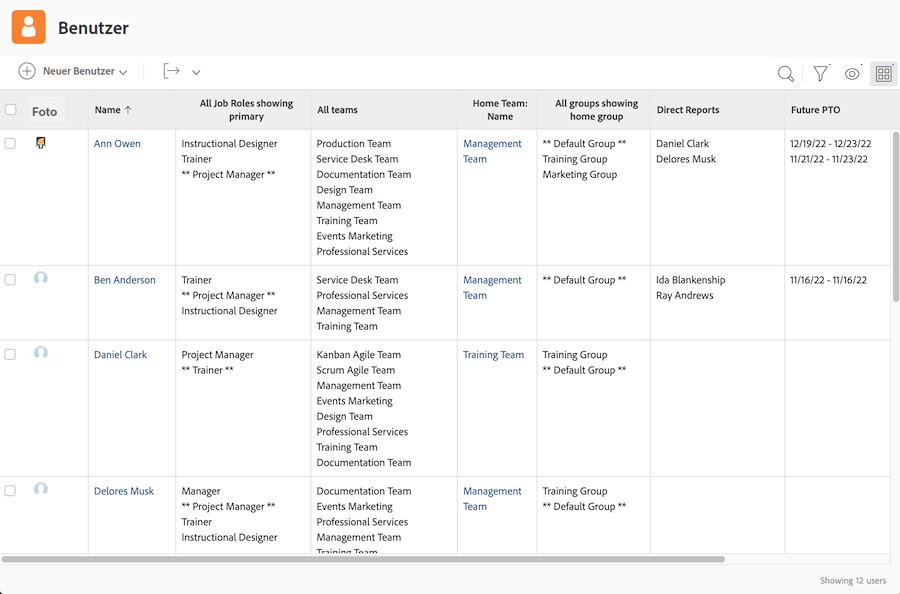

### Aufgabe – So zeigen Sie Aufgabenzuweisungen an und arbeiten an einem Status

```
displayname=Assignments and Status
listdelimiter=<br>
listmethod=nested(assignments).lists
namekey=group.plural
textmode=true
type=iterate
valueexpression=CONCAT({assignedTo}.{name},IF(ISBLANK({assignedTo}.{name}),"",IF({status}="AA"," - Requested",IF({status}="AD"," - Working"," - Done"))))
valueformat=HTML
width=150
```

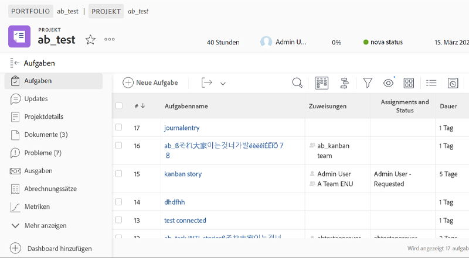


### Aufgabe – So zeigen Sie Rolle und Zuordnung für mehrere Aufgabenzuweisungen an

#### Aufgabe – Rolle + Stunden

```
displayname=Role+hours
listdelimiter=<li>
listmethod=nested(assignments).lists
textmode=true
type=iterate
valueexpression=CONCAT({role}.{name}," (",round({workRequired}/60,2),")")
valueformat=HTML
```

#### Aufgabe – Arbeitsauftrag + Prozentzuordnung

```
displayname=Assignment+percent
valueexpression=CONCAT({assignedTo}.{name}," (",{assignmentPercent},")")
listdelimiter=<li>
listmethod=nested(assignments).lists
valueformat=HTML
textmode=true
type=iterate
```

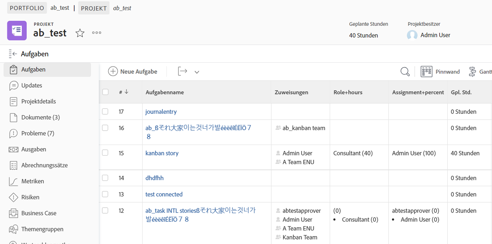

### Aufgabe – Projektübergreifende Vorgänger und Nachfolger

#### Aufgabenfilter (optional)

**Anzeigen aller Aufgaben, die mindestens einen projektübergreifenden Vorgänger oder mindestens einen projektübergreifenden Nachfolger für aktuelle Projekte haben**

```
predecessorsMM:ID_Mod=notblank
predecessorsMM:projectID=FIELD:projectID
predecessorsMM:projectID_Mod=ne
project:statusEquatesWith=CUR
project:statusEquatesWith_Mod=in
OR:1:project:statusEquatesWith=CUR
OR:1:project:statusEquatesWith_Mod=in
OR:1:successorsMM:ID_Mod=notblank
OR:1:successorsMM:projectID=FIELD:projectID
OR:1:successorsMM:projectID_Mod=ne
```

#### Aufgabe – Anzeigen der Vorgängernamen und des Projekts, in dem der Vorgänger ist

```
displayname=Predecessor names
listdelimiter=<br>
listmethod=nested(predecessors).lists
namekey=group.plural
textmode=true
type=iterate
valueexpression=CONCAT("TASK = ",{predecessor}.{name}," >> PROJECT = ",{predecessor}.{project}.{name})
valueformat=HTML
width=150
```

#### Aufgabe – Anzeigen der Nachfolgernamen und des Projekts, in dem der Nachfolger ist

```
displayname=Successor names
listdelimiter=<br>
listmethod=nested(successors).lists
namekey=group.plural
textmode=true
type=iterate
valueexpression=CONCAT("TASK = ",{successor}.{name}," >> PROJECT = ",{successor}.{project}.{name})
valueformat=HTML
width=150
```

#### Aufgabe – Anzeigen des voraussichtlichen Abschlussdatums der Vorgänger

```
displayname=Predecessor projected completion dates
valueformat=atDate
listdelimiter=
textmode=true
width=90
stretch=0
valuefield=predecessor:projectedCompletionDate
type=iterate
listmethod=nested(predecessors).lists
shortview=false
```

#### Aufgabe – Anzeigen des Fortschrittsstatus der Vorgänger

```
displayname=Predecessor progress status
listdelimiter=<br>
listmethod=nested(predecessors).lists
shortview=false
stretch=0
textmode=true
type=iterate
valueexpression=IF({predecessor}.{progressStatus}="OT","On Time",IF({predecessor}.{progressStatus}="LT","Late",IF({predecessor}.{progressStatus}="BH","Behind","At Risk")))
valueformat=HTML
width=90
```

#### Aufgabe – Anzeigen des prozentualen Abschlusses des Projekts des projektübergreifenden Vorgängers

```
displayname=Predecessor project percent complete
listdelimiter=<br>
listmethod=nested(predecessors).lists
namekey=group.plural
textmode=true
type=iterate
valueexpression=IF({isCP}=true,CONCAT({predecessor}.{project}.{percentComplete},"%"),"")
valueformat=HTML
width=150
```

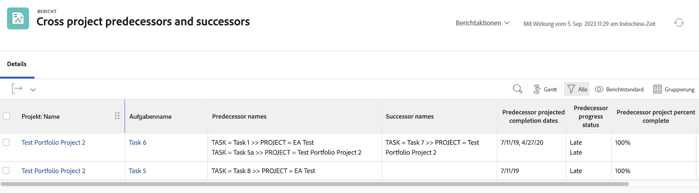


### Aufgabe – Iteration, die alle zugewiesenen Personen anzeigt und zeigt, wer jede von ihnen zugewiesen hat

```
displayname=All assignees and requesters
listdelimiter=<p>
listmethod=nested(assignments).lists
textmode=true
type=iterate
valueexpression=CONCAT("Assigned To: ",{assignedTo}.{name},"; Requested By: ",{assignedBy}.{name})
valueformat=HTML
```

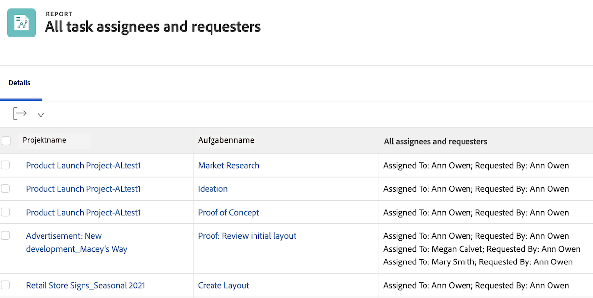

### Aufgabe/Projekt – Iteration mit allen benutzerdefinierten Formularen für ein Projekt oder eine Aufgabe

```
displayname=All Forms Assigned
listdelimiter=<p>
listmethod=nested(objectCategories).lists
textmode=true
type=iterate
valuefield=category:name
valueformat=HTML
```

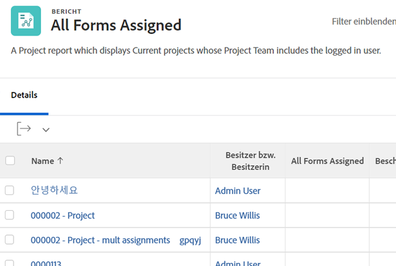


### Projekt – Iteration mit allen Primärkontakten für lösbare Probleme in der Projektansicht

```
displayname=Requestor
listdelimiter=<br>
listmethod=nested(resolvables).lists
namekey=group.plural
textmode=true
type=iterate
valuefield=owner:name
valueformat=HTML
width=150
```

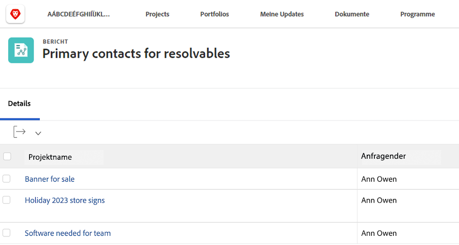

### Projekt – Iteration mit allen Mitgliedern des Projekt-Teams

```
displayname=Project Team Members
listdelimiter=<br>
listmethod=nested(projectUsers).lists
namekey=group.plural
textmode=true
type=iterate
valuefield=user:name
valueformat=HTML
```

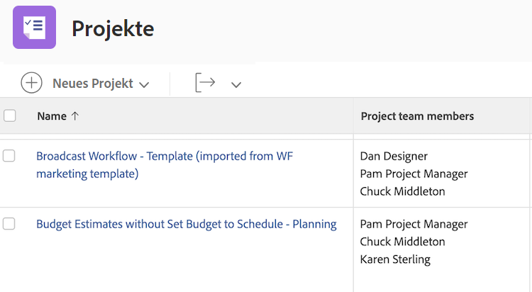

### Projekt – Iteration mit den entryDate aller lösbaren Probleme eines Projekts

```
displayname=Resolvables entry date
linkedname=direct
listdelimiter=<br>
listmethod=nested(project.resolvables).lists
listsort=string(description)
querysort=description
section=0
textmode=true
type=iterate
valuefield=entryDate
valueformat=HTML
```

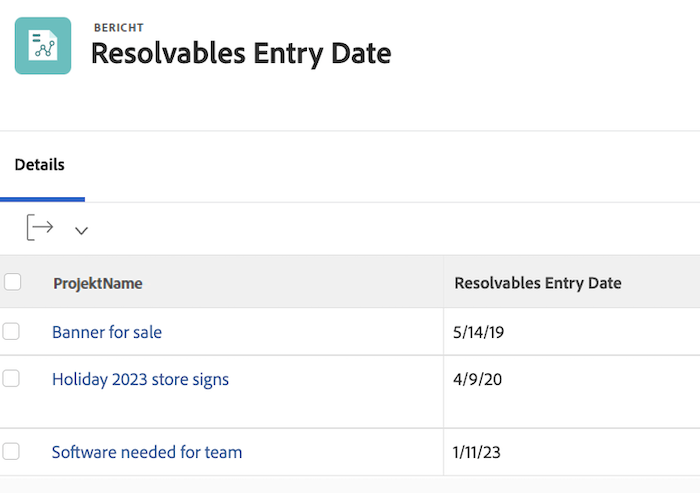

### Projekt – Zeigt die Startgruppe der Person an, die die ursprüngliche Projekt-Anfrage gestellt hat

```
displayname=Requestor home group
linkedname=direct
namekey=name
querysort=convertedOpTaskOriginator:homeGroup:name
textmode=true
valuefield=convertedOpTaskOriginator:homeGroup:name
valueformat=HTML
```

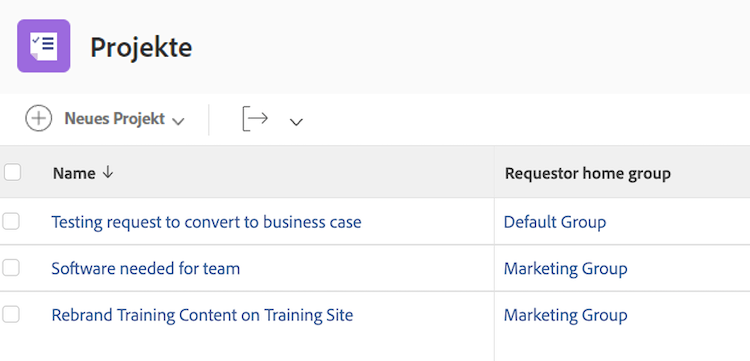

### Projekt – Zeigt an, ob das Projekt eine Anforderungswarteschlange ist

```
querysort=queueDef:isPublic
valueformat=val
description=0 (None), 1 (Public), 2 (Private), 3 (Company), 4 (Group)
linkedname=direct
textmode=true
enumtype=PROJ
valuefield=queueDef:isPublic
namekey=status
type=enum
enumclass=com.attask.common.constants.ProjectStatusEnum
displayname=Public Selection
```

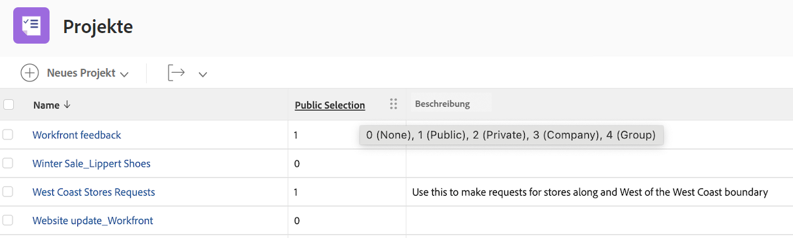

### Problem – Iteration mit allen Mitgliedern des Projektlösungs-Teams

```
displayname=Resolve Project: Team Members
listdelimiter=<br>
listmethod=nested(resolveProject.projectUsers).lists
namekey=group.plural
textmode=true
type=iterate
valuefield=user:name
valueformat=HTML
width=150
```

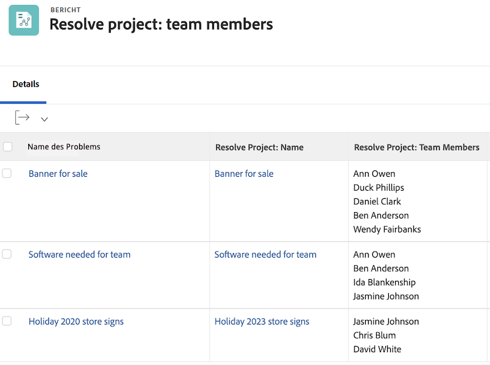

### Problem – Iteration mit allen Primärkontakt-Teams für das Problem

```
displayname=Requestor Teams
listdelimiter=<br>
listmethod=nested(owner.teams).lists
namekey=group.plural
textmode=true
type=iterate
valuefield=name
valueformat=HTML
width=150
```

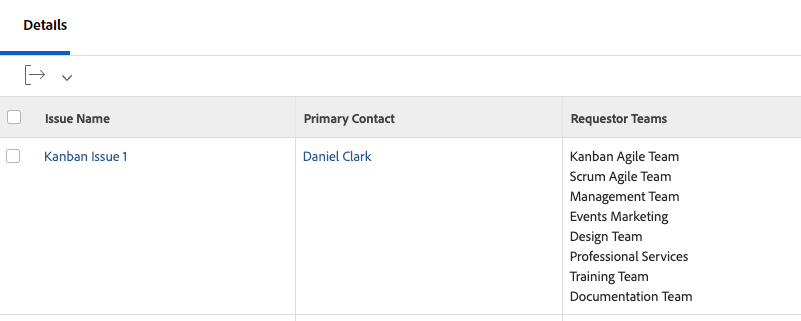

### Dokument – Iteration mit dem Ordner in einem Dokumentbericht

```
displayname=Folder
listdelimiter=<br><br>
listmethod=nested(folders).lists
textmode=true
type=iterate
valuefield=name
valueformat=HTML
```

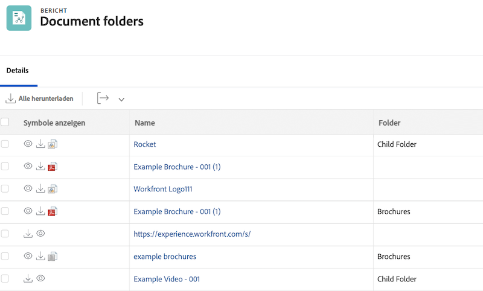

### Dokument – Iteration mit dem übergeordneten Ordner in einem Dokumentbericht

```
displayname=Parent Folder
listdelimiter=<br><br>
listmethod=nested(folders).lists
textmode=true
type=iterate
valuefield=parent:name
valueformat=HTML
```


### Dokument – Datum der Dokumentgenehmigung

```
displayname=Document approval dates
valueformat=HTML
listdelimiter=<br>
linkedname=direct
textmode=true
listsort=string(description)
valuefield=approvalDate
type=iterate
listmethod=nested(approvals).lists
shortview=false
section=0
```

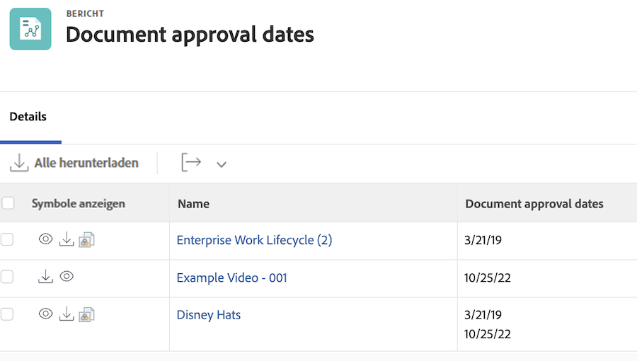

### Korrekturabzug-Genehmigungen

#### Korrekturabzug-Genehmigung – Projektnamen anzeigen

```
displayname=Project Name
textmode=true 
valuefield=documentVersion:document:project:name 
valueformat=HTML
```

#### Korrekturabzug-Genehmigung – Aufgabennamen anzeigen

```
displayname=Task Name
textmode=true 
valuefield=documentVersion:document:task:name 
valueformat=HTML
```

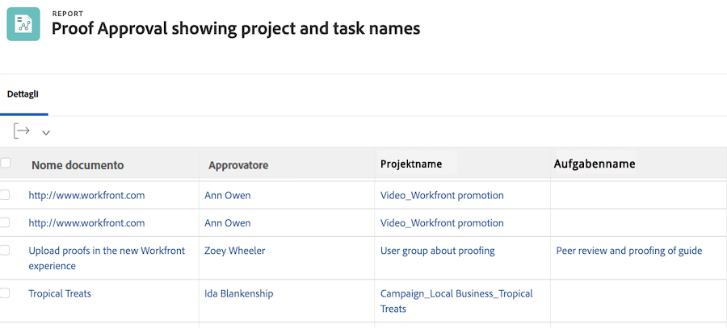
