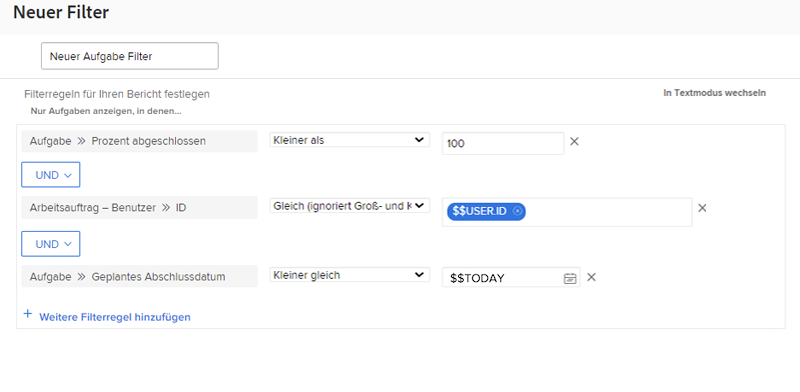

# Erstellen von Filtern mit datumsbasierten Platzhaltern

In diesem Video lernen Sie Folgendes:

* Verwenden datumsbasierter Platzhalter
* Lernen Sie den Unterschied zwischen den beiden datumsbasierten Platzhaltern in Workfront kennen
* Hinzufügen eines datumsbasierten Platzhalters zu einem Filter
* Erstellen eines benutzerdefinierten Datums mithilfe von Platzhaltern, Attributen, Operatoren und Modifikatoren
* Erstellen eines benutzerdefinierten Datumsbereichs mithilfe von Platzhaltern

>[!VIDEO](https://video.tv.adobe.com/v/336812/?quality=12&learn=on)

## Aktivitäten zum Erstellen von Filtern mit datumsbasierten Platzhaltern

### Aktivitätsfragen

1. Wie würden Sie die Filterregel erstellen, wenn Sie nach Ausgaben suchen, deren Fälligkeitsdatum gestern oder heute ist?
1. Wie würden Sie die Filterregel erstellen, um nach Projekten zu suchen, die letzte Woche fällig waren?
1. Folgende Filterregeln sind Teil eines Aufgabenberichts, den Sie regelmäßig verwenden. Welche Art von Ergebnissen würden Sie mit diesem Bericht erzielen?

### Antworten

1. Filtern nach dem geplanten Fertigstellungsdatum der Ausgabe zwischen [!UICONTROL $$TODAY-1d] und [!UICONTROL $$TODAY].
1. Filtern nach dem geplanten Fertigstellungsdatum des Projekts zwischen [!UICONTROL $$TODAYb-1w] und [!UICONTROL $$TODAYe-1w].
1. In diesem Bericht werden die Ihnen zugewiesenen Aufgaben angezeigt, die noch nicht abgeschlossen sind (d. h. deren Fertigstellungsgrad unter 100 % liegt) und die überfällig oder heute fällig sind. Die Filterregel für das geplante Fertigstellungsdatum der Aufgaben besagt, dass nach Aufgaben mit einem Fälligkeitsdatum vor oder gleich dem heutigen Datum gesucht werden soll.
