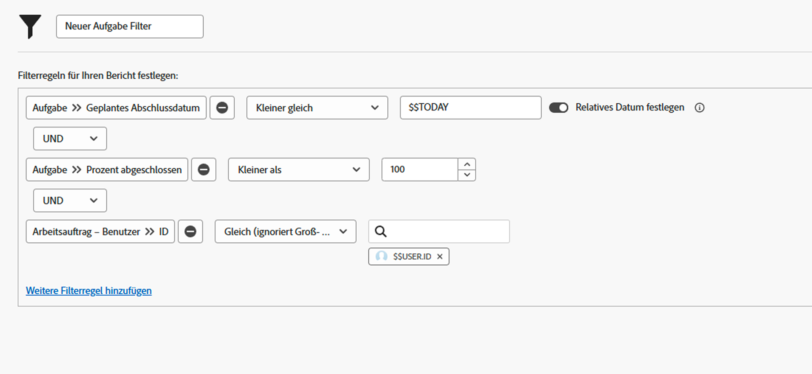

# Erstellen von Filtern mit datumsbasierten Platzhaltern

In diesem Video erfahren Sie, wie Sie:

* Verwenden datumsbasierter Platzhalter
* Machen Sie sich mit dem Unterschied zwischen den beiden datumsbasierten Platzhaltern von Workfront vertraut.
* Datumsbasierter Platzhalter zu einem Filter hinzufügen
* Benutzerdefiniertes Datum mit Platzhaltern, Attributen, Operatoren und Modifikatoren erstellen
* Benutzerdefinierten Datumsbereich mit Platzhaltern erstellen

>[!VIDEO](https://video.tv.adobe.com/v/336812/?quality=12)

## Aktivitätsfragen

1. Wie würden Sie die Filterregel erstellen, wenn Sie möchten, dass Probleme mit einem Fälligkeitsdatum von gestern oder heute auftreten?
1. Wie würden Sie die Filterregel erstellen, um Projekte zu finden, die letzte Woche fällig waren?
1. Die folgenden Filterregeln sind Teil eines regelmäßig von Ihnen verwendeten Aufgabenberichts. Welche Ergebnisse würden Sie aus diesem Bericht erhalten?

## Antworten

1. Filtern Sie nach dem geplanten Abschlussdatum des Problems zwischen [!UICONTROL $$TODAY-1d] und [!UICONTROL $$HEUTE].
1. Filtern Sie nach dem geplanten Abschlussdatum des Projekts zwischen [!UICONTROL $$TODAYb-1w] und [!UICONTROL $$TODAYe-1w].
1. Dieser Bericht findet Ihnen zugewiesene Aufgaben, die noch nicht abgeschlossen sind (d. h. einen Prozentsatz von weniger als 100 abgeschlossen haben) und die heute überfällig oder fällig sind. Die Filterregel für das geplante Fertigstellungsdatum der Aufgaben zeigt Aufgaben an, deren Fälligkeitsdatum mit dem heutigen Datum oder vor dem heutigen Datum identisch ist.
