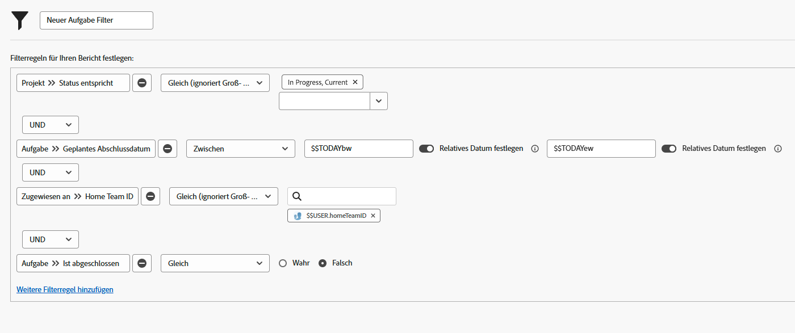

# Erstellen von Filtern mit benutzerbasierten Platzhaltern

In diesem Video lernen Sie Folgendes:

* Grundlegendes dazu, warum Platzhalter verwendet werden
* Erstellen eines Filters mit einem benutzerbasierten Platzhalter

>[!VIDEO](https://video.tv.adobe.com/v/336810/?quality=12&learn=on)

>[!TIP]
>
>Verwenden Sie beim Erstellen von Filtern, die sich mit Aufgaben- oder Problemzuweisungsinformationen beschäftigen, die Option „Arbeitsauftrag – Benutzer“ >> „ID-Feldquelle und -Name“.  Bei dieser Option werden alle der Aufgabe oder dem Problem zugewiesenen Benutzenden berücksichtigt, nicht nur die Person, die sie bzw. es „besitzt“ oder hauptsächlich damit betraut wurde.

>[!TIP]
>
>Verwenden Sie die $$USER.ID (statt Ihres Namens), selbst dann, wenn Sie Filter für sich selbst erstellen. Wenn also eine Person einen Filter sieht, den Sie gerade verwenden, und Sie bittet, diesen für sie freizugeben, ist dadurch der Filter bereits so eingerichtet, dass jede Person, die ihn verwendet, ihre eigenen Informationen sieht.

>[!TIP]
>
>Bei der Verwendung von benutzerbasierten Platzhaltern müssen Sie immer den Filterqualifizierer „Gleich“ verwenden.

## „Erstellen von Filtern mit benutzerbasierten Platzhalteraktivitäten“

### Aktivität 1

Sie haben diese Woche etwas mehr Zeit und möchten daher herausfinden, ob es in Ihrem Team eine Person gibt, die bei ihren Arbeitsaufträgen Unterstützung gebrauchen könnte. Erstellen Sie einen Aufgabenfilter, um Aufgaben zu finden, die diese Woche fällig sind und noch nicht erledigt wurden.

### Antwort 1

Es ist sehr nett von Ihnen, dass Sie den anderen Mitgliedern Ihres Teams unter die Arme greifen! Wenn der Filter wie in der Abbildung unten eingerichtet ist, finden Sie:

* Aufgaben, die noch nicht abgeschlossen sind (d. h. sie haben nicht den Status [!UICONTROL Abgeschlossen] oder einen Status, der [!UICONTROL Abgeschlossen] entspricht);
* Aufgaben, die sich in Projekten mit dem Status [!UICONTROL Aktuell] befinden (schließlich möchten Sie keine Aufgaben für Projekte finden, die noch nicht gestartet sind);
* Aufgaben, die einer Person in Ihrem Stamm-Team zugewiesen wurden, wie in den Team-Einstellungen von Workfront definiert;
* sowie Aufgaben, die ein Fertigstellungsdatum irgendwann in dieser Woche haben (diese Regel wendet den vorkonfigurierten Datumsfilter an, um „diese Woche“ zu definieren).

Möglicherweise müssen Sie zusätzliche Filter hinzufügen, wenn Sie die Liste noch weiter einschränken möchten. Sie können zum Beispiel eine Filterregel hinzufügen, die ein bestimmtes Programm oder Portfolio berücksichtigt, in dem Ihr Team arbeitet.
