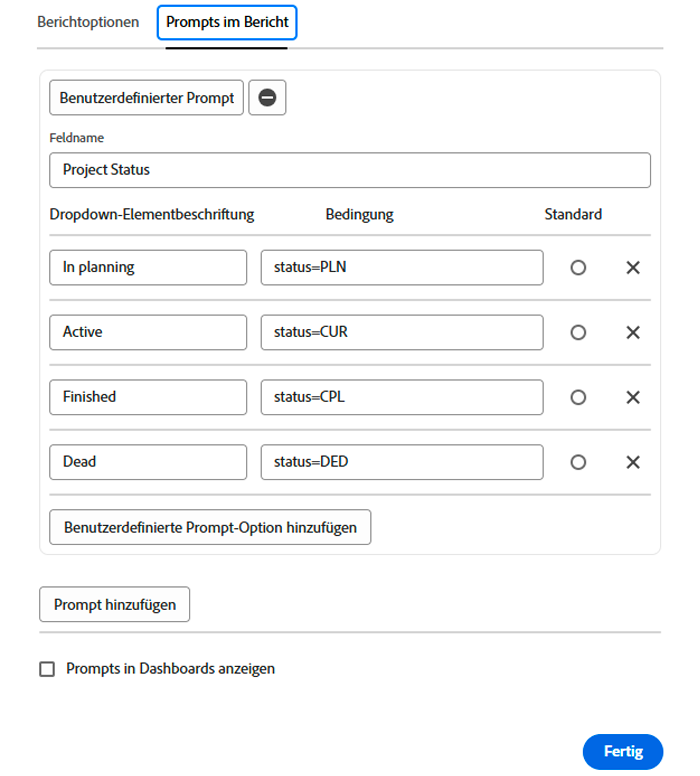
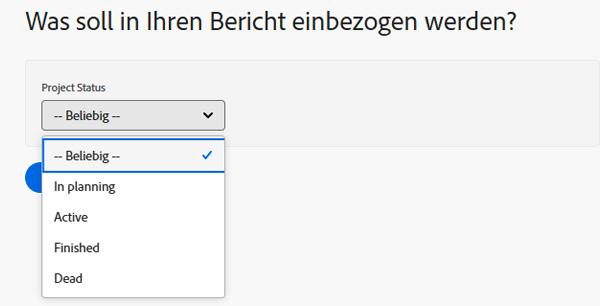
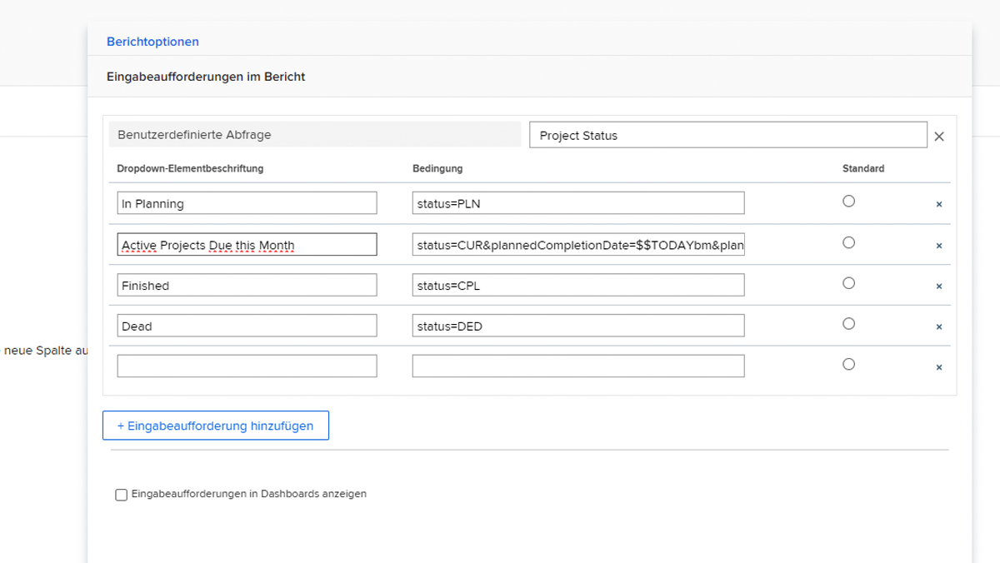

# Erstellen von benutzerdefinierten Eingabeaufforderungen im Textmodus

In diesem Video lernen Sie Folgendes:

* Was ist ein benutzerdefinierter Prompt?
* Erstellen eines benutzerdefinierten Prompts im Textmodus
* Einige Beispiele, die Sie in Ihren Berichten verwenden können

>[!VIDEO](https://video.tv.adobe.com/v/336822/?quality=12&learn=on&enablevpops=0)

## Aktivitäten zum Erstellen benutzerdefinierter Prompts


### Aktivität: Benutzerdefinierte Prompts erstellen

1. Erstellen Sie einen benutzerdefinierten Prompt, der folgende Projektstatus im Dropdown-Menü der Eingabeaufforderung anzeigt:
   * In Planung
   * Aktuell
   * Abgeschlossen
   * Eingestellt
1. Ändern Sie den Prompt so, dass aktuelle Projekte angezeigt werden, die in diesem Monat fällig sind.

### Antworten

1. Ihre benutzerdefinierten Prompts sollten in etwa wie folgt aussehen und folgenden Textmodus aufweisen:

   

   Nachdem Sie den benutzerdefinierten Prompt gespeichert haben, sollte das Dropdown-Menü für den Prompt wie folgt aussehen:

1. Der Textmodus in Ihrem benutzerdefinierten Prompt sollte wie folgt aussehen:



```
   status=CUR&plannedCompletionDate=$$TODAYbm&plannedCompletionDate_Mod=between&plannedCompletionDate_Range=$$TODAYem 
```

Außerdem sollte die Dropdown-Beschriftung für aktive Prompts aktualisiert werden, um die Code-Änderung wie folgt widerzuspiegeln:


