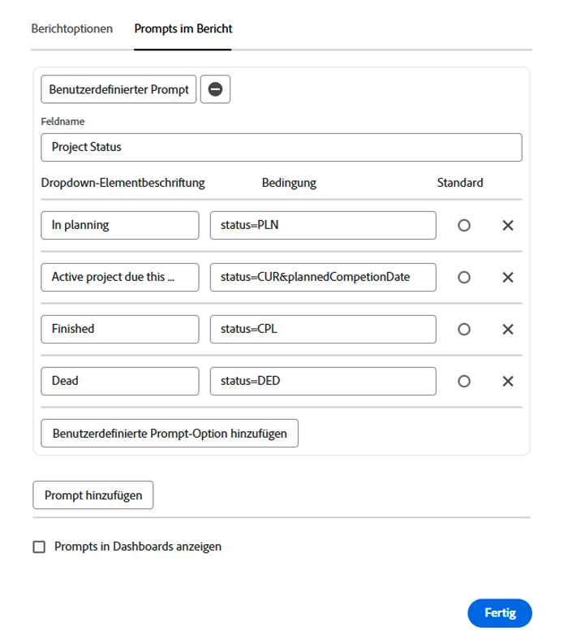

# Erstellen benutzerdefinierter Eingabeaufforderungen

In diesem Video lernen Sie Folgendes:

* Was ist eine benutzerdefinierte Eingabeaufforderung?
* Erstellen einer benutzerdefinierten Eingabeaufforderung im Textmodus
* Einige Beispiele, die Sie in Ihren Berichten verwenden können

>[!VIDEO](https://video.tv.adobe.com/v/336822/?quality=12&learn=on)

## Aktivitäten zum Erstellen benutzerdefinierter Eingabeaufforderungen


### Aktivität: Benutzerdefinierte Eingabeaufforderungen erstellen

1. Erstellen Sie eine benutzerdefinierte Eingabeaufforderung, die folgende Projektstatus im Dropdown-Menü der Eingabeaufforderung anzeigt:
   * In Planung
   * Aktuell
   * Abgeschlossen
   * Eingestellt
1. Ändern Sie die Eingabeaufforderung so, dass aktuelle Projekte angezeigt werden, die in diesem Monat fällig sind.

### Antworten

1. Ihre benutzerdefinierten Eingabeaufforderungen sollten in etwa wie folgt aussehen und folgenden Textmodus aufweisen:

   

   Nachdem Sie die benutzerdefinierte Eingabeaufforderung gespeichert haben, sollte das Dropdown-Menü für die Eingabeaufforderung wie folgt aussehen:

1. Der Textmodus in Ihrer benutzerdefinierten Eingabeaufforderung sollte wie folgt aussehen:


```
   status=CUR&plannedCompletionDate=$$TODAYbm&plannedCompletionDate_Mod=between&plannedCompletionDate_Range=$$TODAYem 
```

Außerdem sollte die Dropdown-Beschriftung für aktive Eingabeaufforderungen aktualisiert werden, um die Code-Änderung wie folgt widerzuspiegeln:


