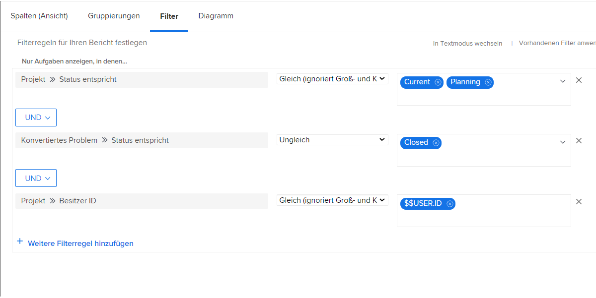
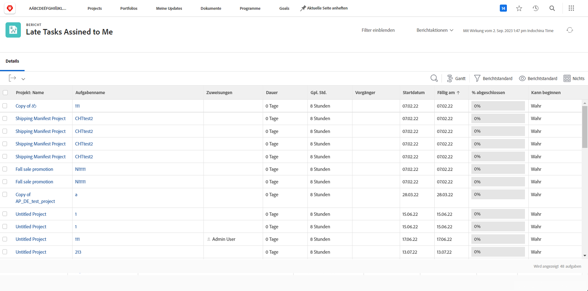

# Grundlegendes zu integrierten Problemfiltern

In diesem Video werden Sie:

* Integrierte Problemfilter überprüfen, um zu sehen, wie sie erstellt wurden
* Mehr über einige nützliche Elemente zur Problemberichterstellung erfahren
* Lernen, wie Sie einen eigenen Problemfilter erstellen

>[!VIDEO](https://video.tv.adobe.com/v/336819/?quality=12&learn=on)

## Aktivitäten: Grundlegendes zu integrierten Problemfiltern

### Aktivität: Erstellen eines Problemberichts

Sie möchten alle Probleme sehen, die noch für alle aktiven Projekte, für die Sie verantwortlich sind, gelöst werden müssen, einschließlich der Probleme mit einem Lösungsobjekt. Erstellen Sie einen Problembericht und nennen Sie ihn „Ungelöste Probleme bei Projekten, für die ich verantwortlich bin“.

### Antwort

So sollte der Filter aussehen:

Im integrierten Filter „Meine offenen Probleme“ schloss eine der Filterregeln alle Probleme aus, für die es ein Lösungsobjekt gab. Der Grund dafür ist, dass Sie sich um diese Probleme nicht kümmern müssen. Jemand hat bereits ein Projekt, eine Aufgabe oder ein Problem erstellt, das diese lösen wird – was gibt es da also noch zu befürchten? Doch sie sind nun mal noch nicht gelöst. In unserem Beispiel beziehen wir sie deshalb mit ein, damit sie leicht zu identifizieren sind und überprüft werden kann, wie es damit steht.

Dazu müssen Sie auf der Registerkarte „Ansicht“ eine Spalte für „Problem >> Lösungsobjekt“ hinzufügen. Hier wird der Name des Lösungsobjekts angezeigt, falls vorhanden, egal ob es sich um ein Projekt, eine Aufgabe oder ein Problem handelt. Durch Klicken auf den Namen gelangen Sie zum Lösungsobjekt.

Es ist empfehlenswert, die Liste anhand des Projektnamens zu gruppieren.

So sollte der Bericht aussehen:

