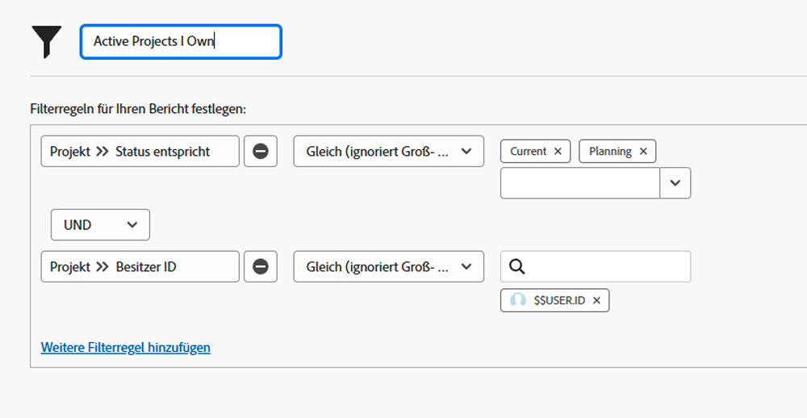

# Erkunden integrierter Projektfilter

In diesem Video lernen Sie Folgendes:

* Überprüfen der integrierten Projektfilter, um zu sehen, wie sie erstellt wurden
* Erstellen eines eigenen Projektfilters mit dem, was Sie gelernt haben

>[!VIDEO](https://video.tv.adobe.com/v/336817/?quality=12&learn=on&enablevpops=0)

## Aktivitäten: Grundlegendes zu integrierten Projektfiltern

### Aktivität: Erstellen eines Projektfilters

Sie möchten alle aktiven Projekte sehen, für die Sie verantwortlich sind, wobei „aktiv“ bedeutet, dass der Projektstatus mit „In Planung“ oder „Aktuell“ gleichzusetzen ist. Erstellen Sie im Bereich „Projekte“ einen Projektfilter mit dem Namen „Aktive Projekte, für die ich verantwortlich bin“.

### Antwort

Ihr Filter sollte wie folgt aussehen:

Sie können zusätzliche Filterregeln einfügen, z. B. die Suche nach Projekten in einem bestimmten Programm oder Portfolio. In diesem Fall empfiehlt Workfront, den Filter in eine passende Beschreibung umzubenennen, z. B. „Aktive Projekte, für die ich im Marketing-Portfolio verantwortlich bin“.
