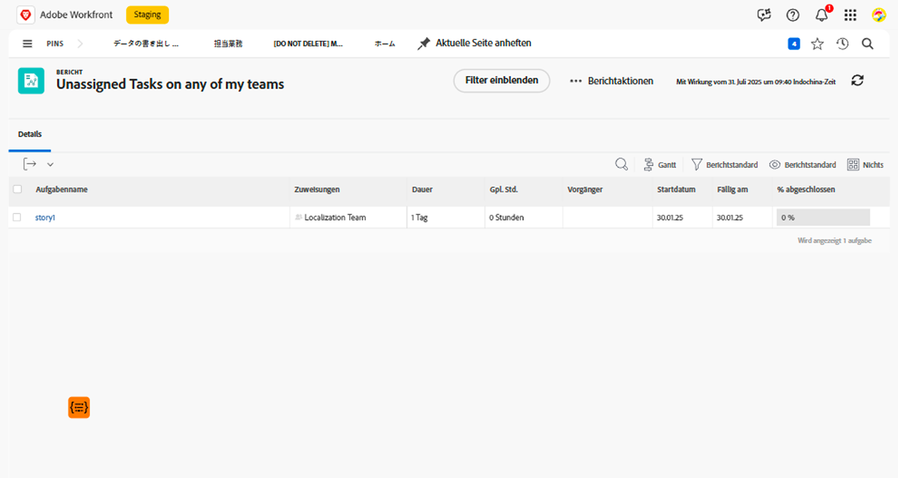

# Grundlegendes zu integrierten Aufgabenfiltern

In diesem Video werden Sie:

* Überprüfen Sie integrierte Aufgabenfilter, um zu sehen, wie sie erstellt wurden
* Erfahren Sie mehr über einige nützliche Elemente zur Aufgabenberichterstellung
* Erfahren Sie, wie Sie einen eigenen Aufgabenfilter erstellen

>[!VIDEO](https://video.tv.adobe.com/v/336818/?quality=12&learn=on)

## Aktivitäten: Grundlegendes zu integrierten Aufgabenfiltern

### Aktivität: Einen Aufgabenbericht erstellen

Sie sollten genau überprüfen, welche der Ihren Teams zugewiesenen Aufgaben noch von niemandem übernommen wurden. Erstellen Sie einen Aufgabenbericht mit dem Namen „Nicht zugewiesene Aufgaben für eines oder mehrere meiner Teams“.

### Antwort

So sollte der Filter aussehen:

Richten Sie Ihre Spaltenansicht so ein, dass sie die Felder enthält, an denen Sie interessiert sind oder die Sie inline bearbeiten möchten. Sie können beispielsweise eine Spalte „Arbeitsaufträge“ einfügen, um einem Team-Mitglied eine Aufgabe direkt aus dem Bericht zuweisen zu können.

Sie können die Liste anhand des Namens des Teams gruppieren, das jeder Aufgabe zugewiesen ist.

So könnte der Bericht aussehen:

