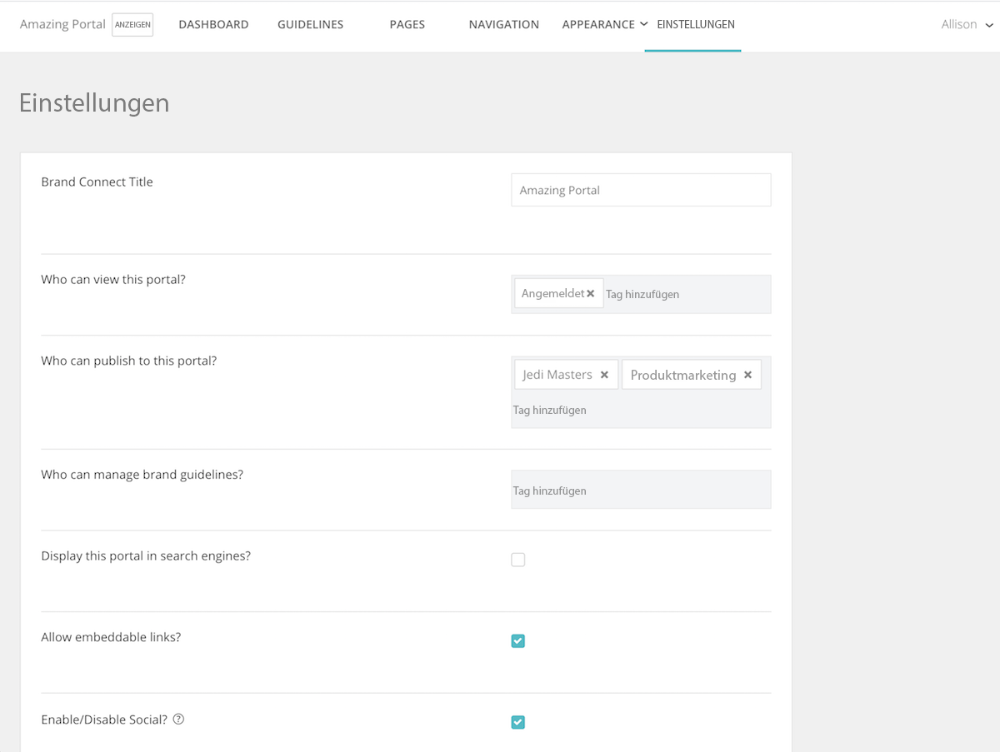

# Einrichten der Systemeinstellungen in [!UICONTROL Brand Connect]

Die [!UICONTROL Brand Connect]-Einstellungen legen fest, wer das Portal sehen kann, wer Inhalte im Portal veröffentlichen kann und wer die Markenrichtlinien verwalten kann.

Um auf die Einstellungen zuzugreifen, melden Sie sich bei [!UICONTROL Workfront DAM] an.

1. Klicken Sie in der Navigationsleiste auf das **Einstellungssymbol** und wählen Sie **[!UICONTROL Brand Connect]**. Oder klicken Sie auf **[!UICONTROL Marken]** in der Navigationsleiste.
1. Klicken Sie dann auf die Option **[!UICONTROL Bearbeiten]** oben rechts im Fenster [!UICONTROL Brand Connect]. Wenn Ihr Unternehmen mehrere [!UICONTROL Brand Connects] hat, stellen Sie sicher, dass Sie die richtige bearbeiten.

Wenden Sie sich an Ihre [!UICONTROL Workfront]-Beraterin bzw. Ihren -Berater, wenn Sie Fragen zu einer dieser Einstellungen haben.

* **[!UICONTROL Brand Connect]-Titel** – Benennen Sie die [!UICONTROL Brand Connect] (oder ändern Sie den Namen).
* **Wer kann dieses Portal anzeigen?** - Legen Sie die Gruppen fest, die den [!UICONTROL Brand Connect“ anzeigen &#x200B;]. Wenn Sie zum Beispiel die Gruppe [!UICONTROL Angemeldet] hinzufügen, können alle angemeldeten Benutzenden das Portal sehen. Die Ordnerberechtigungen gelten jedoch weiterhin, d. h. auch wenn eine Person das Portal sehen kann, kann sie nicht auf Assets zugreifen, es sei denn, der Gruppe [!UICONTROL Angemeldet] wurden Berechtigungen für den Ordner erteilt.
* **Wer kann in diesem Portal veröffentlichen?** - Legen Sie die Gruppen fest, die Assets in [!UICONTROL Brand Connect] veröffentlichen können. Es handelt sich dabei um Gruppen von Mitwirkenden. Sie können nur Artikel veröffentlichen, auf die sie Zugriff haben.
* **Wer kann Markenrichtlinien verwalten?** - Legen Sie die Gruppen fest, die die Markenrichtlinien verwalten können. Die Verwaltung der Richtlinien ist nicht auf Admin-Benutzende beschränkt. Sie können eine Gruppe von Mitwirkenden festlegen, die die Richtlinien bearbeiten kann.
* **Dieses Portal in Suchmaschinen anzeigen?** - Soll die URL von [!UICONTROL Brand Connect] angezeigt werden, wenn Benutzer Suchvorgänge im Internet durchführen?
* **Einbettbare Links zulassen?** - Können einbettbare Links von &quot;[!UICONTROL &#x200B; Connect“ &#x200B;]? Dies fügt das Fenster [!UICONTROL Links abrufen] zum Menü [!UICONTROL Freigeben] hinzu, das eingebettete Links für das Asset bietet.
* **Social aktivieren/deaktivieren?** - Wenn Social aktiviert ist (Kontrollkästchen aktivieren), können Benutzer Assets mögen und kommentieren.
* **Download- und Ansichtsanzahl aktivieren/deaktivieren?** - Wenn diese Option aktiviert ist, können Benutzer sehen, wie oft ein Asset heruntergeladen wurde und wie viele Kommentare es enthält.
* **Facetten zunächst ausblenden** – Blendet die Filter für die Metadatensuche aus, die im linken Bereich der Seite [!UICONTROL Assets] angezeigt werden.
* **Lightbox-Bezeichnung** – Wählen Sie eine Bezeichnung für [!UICONTROL Lightboxes] – [!UICONTROL Lightbox], [!UICONTROL Sammlung] oder [!UICONTROL Favoriten] aus.
