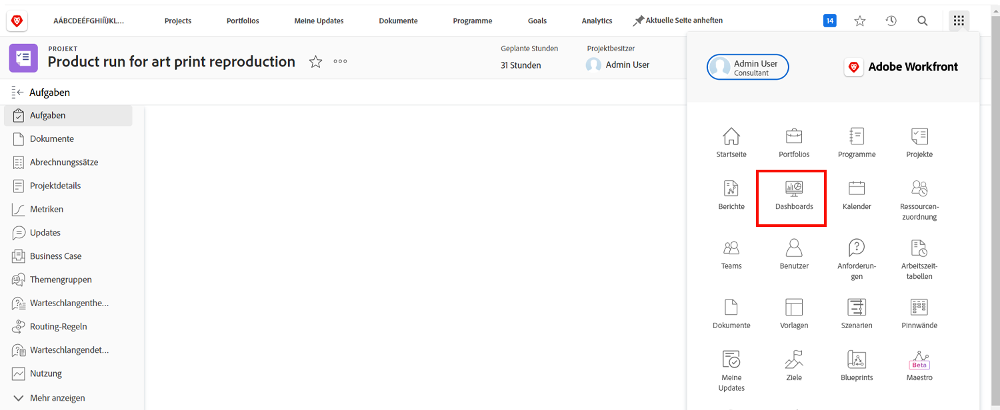
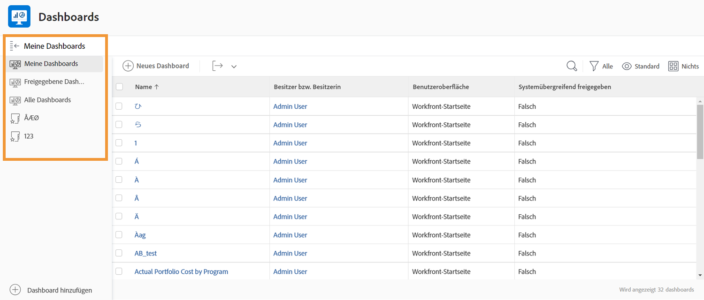
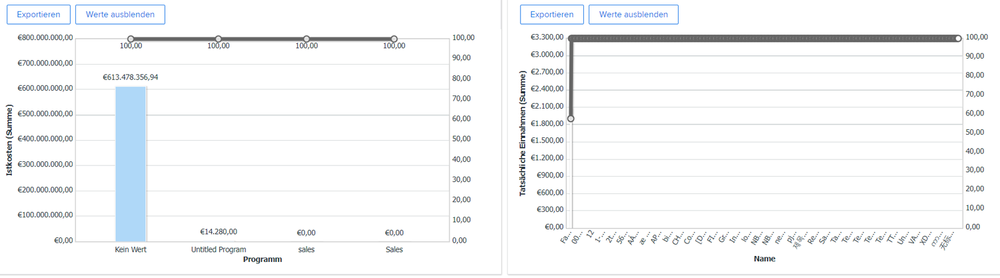
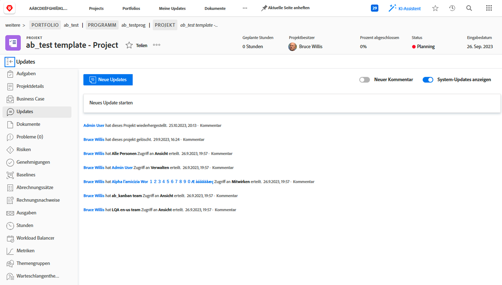
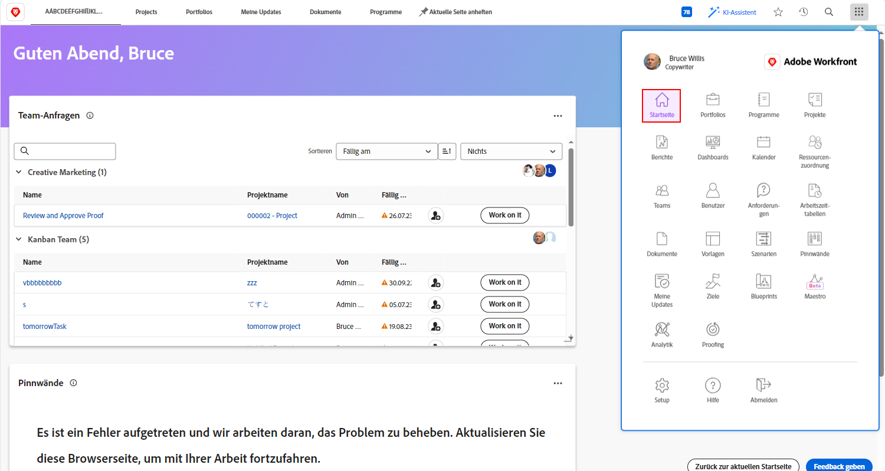

# Workfront für Führungskräfte

Erfahren Sie, wie Sie mit Workfront die Arbeit in Ihrem Unternehmen verwalten können.

Als Führungskraft bietet Ihnen Adobe Workfront Folgendes:

* Informationen über den Fortschritt der Arbeiten, die Sie betreffen, mithilfe von **Berichten und Dashboards**
* Einfache **Kommunikation mit den Projektbeteiligten durch Aktualisierungen**
* Einfache Erstellung von **Arbeitsanfragen**
* Einfacher Einblick in die **Elemente, die auf Ihre Genehmigung warten**

## Berichte und Dashboards

### Berichte

Die Berichte in Workfront sind die Basis für bessere und schnellere Entscheidungen. Sie können sie überall sehen – im Projektbereich, im Personenbereich oder auf einer Aufgaben-Landingpage.

Leitungs- und Führungskräfte können zum Berichtsbereich navigieren, um benutzerdefinierte Berichte mit spezifischen Informationen anzuzeigen. Um die Sichtbarkeit der wichtigsten Berichte zu verbessern, verwendet Workfront Dashboards.

### Dashboards

Ein Dashboard ist eine Sammlung von Berichten mit Informationen, die die Führungskräfte regelmäßig benötigen, um sich einen Überblick zu verschaffen. Das Dashboard ist einfach eine Sammlung von Berichten, die Informationen liefern, welche die Führungskräfte regelmäßig sehen sollten. Die Dashboards sind vollständig anpassbar, sodass alle Workfront-Benutzenden die für sie jeweils wichtigen Arbeiten sehen können.

Klicken Sie im Hauptmenü oben rechts auf „Dashboards“, um den Dashboard-Bereich zu öffnen.

Führungskräfte können über die Navigation im linken Fenster auf die verschiedenen Dashboards zugreifen, die ihnen zur Verfügung stehen.

* **Alle Dashboards**: Zeigt die Dashboards an, die Sie oder andere Benutzende erstellt haben und für die Sie zumindest Ansichtsrechte haben.
* **Meine Dashboards**: Zeigt die Dashboards an, die Sie erstellt haben.
* **Freigegebene Dashboards**: Zeigt die Dashboards an, die von anderen Benutzenden erstellt und für Sie freigegeben wurden.

Mit einem Dashboard können Führungskräfte wichtige Projekte und offene Fragen überprüfen, mit denen sich ihre Teams befassen, wie z. B. „Kosten, Einnahmen und Budgets“. Sie können auch gefährdete Projekte sehen sowie eine Liste der Punkte, die von der Geschäftsführung genehmigt werden müssen.

Berichte in Workfront können dazu beitragen, die Verantwortlichkeit Ihrer Mitarbeitenden zu erhöhen. Der Schlüssel zur Nutzung von Berichten besteht darin, einen klaren Ablauf für ihre Verwendung in Ihrem Unternehmen festzulegen. Stellen Sie sicher, dass jeder weiß, welche Berichte zur Erfolgsmessung verwendet werden.

Beispiel für Berichte in einem Dashboard in Workfront

## Kommunikation mit Projekt-Stakeholdern mithilfe von Aktualisierungen

Kommunizieren Sie mit dem Projekt-Team innerhalb des Projekts selbst, damit alle Projektmitteilungen leicht zugänglich sind.

## Anfrage stellen

In vielen Unternehmen besteht der erste Schritt zum Start eines neuen Projekts, zur Entwicklung eines neuen Produkts oder zur Erstellung einer Leistung darin, eine Anfrage in Workfront zu stellen. Sie können den Fortschritt der Anfrage verfolgen und bei Bedarf zusätzliche Informationen bereitstellen.

In diesem Video lernen Sie Folgendes:

* Zum Anfragebereich navigieren
* Anfrage stellen
* Ihre eingereichten Anfragen ansehen

>[!VIDEO](https://video.tv.adobe.com/v/336092/?quality=12&learn=on)

## Elemente, die auf Ihre Genehmigung warten

Auf der [!UICONTROL Startseite] können Sie ganz einfach Elemente finden, die auf Ihre Genehmigung warten.

