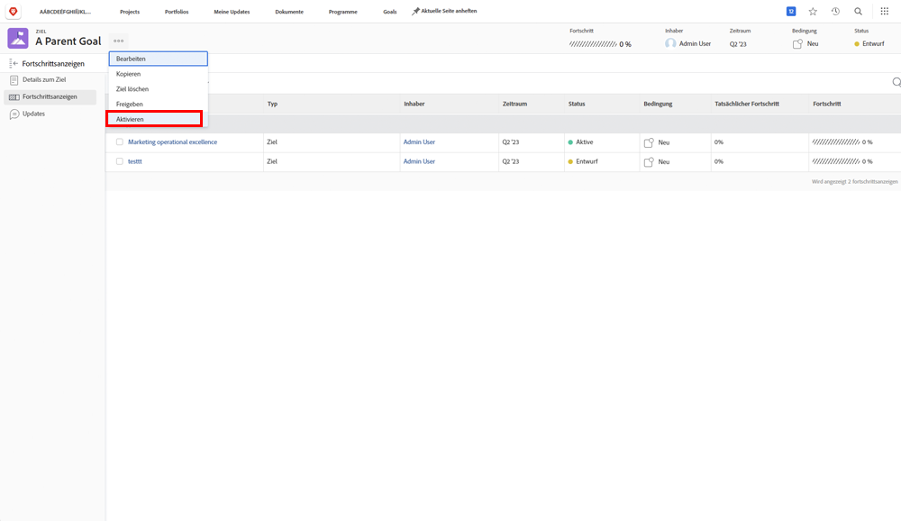

# Aktivieren durch Ausrichtung eines Ziels an einem anderen

Wenn Sie zwei Ziele aufeinander abstimmen, wird das eine zum übergeordneten Ziel und das andere zum untergeordneten Ziel. Ein übergeordnetes Ziel kann mehrere untergeordnete Ziele haben, ein untergeordnetes Ziel kann jedoch nur auf ein übergeordnetes Ziel abgestimmt sein.

1. Öffnen Sie das untergeordnete Ziel, indem Sie in der [!UICONTROL Zielliste] auf den Namen des Ziels klicken. Standardmäßig öffnet dies die Registerkarte [!UICONTROL Zieldetails].
1. Klicken Sie auf die Schaltfläche [!UICONTROL +Hinzufügen] im Bereich [!UICONTROL Informationen zum übergeordneten Ziel].

   ![Ein Screenshot der Registerkarte [!UICONTROL Zieldetails]](assets/06-workfront-goals-align-goals.png)

1. Beginnen Sie mit der Eingabe des Namens des gewünschten übergeordneten Ziels in das Feld [!UICONTROL Übergeordnetes Ziel] und wählen Sie es aus, wenn es in der Liste erscheint. In der Liste werden nur Ziele aus demselben Zeitraum oder einem künftigen Zeitraum angezeigt.

   ![Ein Screenshot des Bedienfelds [!UICONTROL Zieldetails], in dem der Bereich [!UICONTROL Informationen zum übergeordneten Ziel] hervorgehoben ist](assets/07-workfront-goals-align-to.png)

1. Klicken Sie auf [!UICONTROL Änderungen speichern].

Durch die Abstimmung eines Ziels auf ein anderes Ziel entsteht ein untergeordnetes Ziel. Betrachten Sie untergeordnete Ziele als einzelne Ziele, die zum Fortschritt der übergeordneten Ziele des Unternehmens oder des Teams beitragen. Untergeordnete Ziele können den Fortschritt des übergeordneten Ziels aktivieren und beeinflussen.

## Aktivieren Sie jetzt das übergeordnete Ziel

Nachdem Sie nun ein untergeordnetes Ziel erstellt haben, wird es zu einem Fortschrittsindikator für Ihr übergeordnetes Ziel. Sie sehen die Option „Aktivieren“, wenn Sie auf das Drei-Punkte-Symbol neben dem Namen des übergeordneten Ziels klicken.

