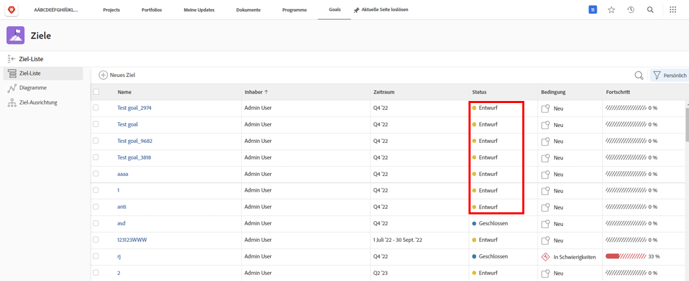
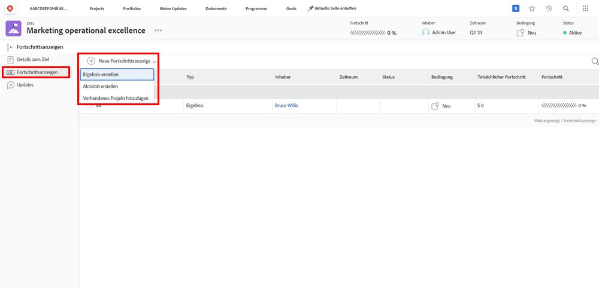
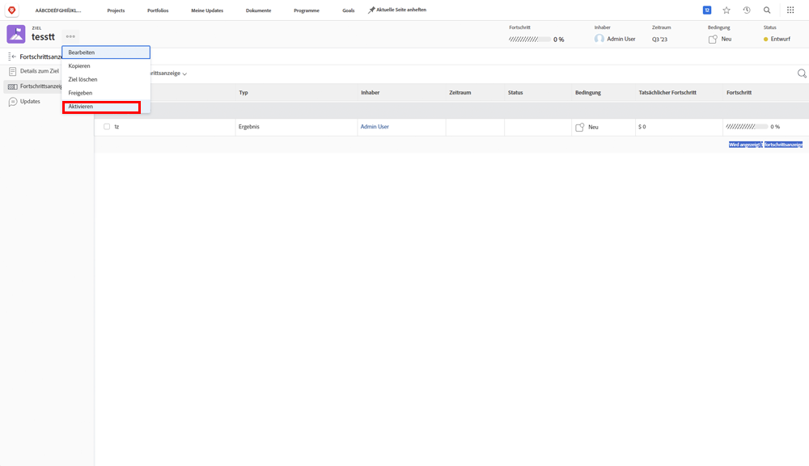

# Aktivieren von Zielen in [!DNL Workfront]

Nachdem Sie Ziele erstellt haben, aktivieren wir sie! Wenn Sie ein Ziel erstellen, wird es in [!UICONTROL Entwurf] Status. [!UICONTROL Entwurf] -Ziele sind erst dann Teil der Zielverwaltung, wenn Sie sie aktivieren. Nach der Aktivierung wechseln sie zu einem [!UICONTROL Aktiv] Status und Fortschritt im Dashboard anzeigen sowie ihre Anpassung an die Gesamtstrategie. Ziele in [!UICONTROL Aktiv] Status sind mit einem Fortschrittsanzeigen verknüpft - normalerweise mit einer Aktivität, einem Ergebnis, einem Projekt oder einem ausgerichteten Ziel (untergeordnete/übergeordnete Zielbeziehung).

## Fortschrittsanzeigen sind erforderlich, um Ziele zu aktivieren

Bevor Sie fortfahren, müssen Sie die in [!DNL Workfront Goals]. Fortschrittsanzeigen sind Objekte in [!DNL Goals] wird verwendet, um den Fortschritt eines Ziels zu berechnen. Die Fortschrittsindikatoren sind aufeinander abgestimmte Ziele, Ergebnisse, Aktivitäten und Projekte. Sie werden später mehr darüber erfahren. Zunächst ist es wichtig zu verstehen, dass einem Ziel abgestimmte Ziele, Ergebnisse, Aktivitäten und Projekte hinzugefügt werden müssen, um es zu aktivieren.

Um eine Fortschrittsanzeige hinzuzufügen, öffnen Sie das Ziel und wählen Sie auf der linken Seite die Registerkarte Fortschrittsindikatoren und dann das Dropdown-Menü Neue Fortschrittsanzeige .

Verglichen mit anderen Fortschrittsanzeigen sind Projekte etwas einzigartig, da sie als eine Art von Aktivität betrachtet werden. Aktivitäten können in zwei Typen unterteilt werden: manueller Fortschrittsbalken und Projekte. Daher werden auch Projekte den Fortschritt fördern. Obwohl alle Arten von Fortschrittsanzeigen mit einem übergeordneten Ziel verbunden werden können, sollten Sie beachten, dass es Unterschiede bei der Verwaltung gibt.

## Aktivieren Sie jetzt das Ziel.

Wenn Sie mindestens eine Fortschrittsanzeige für Ihr Ziel haben, wird die Option Aktivieren angezeigt, wenn Sie auf das drei Punktmenü neben dem Zielnamen klicken.

