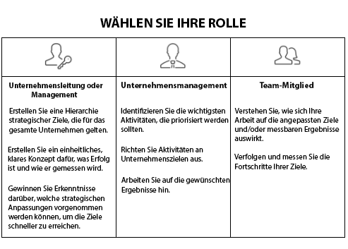

# Einrichten von [!UICONTROL Workfront-Zielen] für Ihre Organisation

*Dieser Abschnitt richtet sich an [!DNL Workfront]-Systemadmins, die für die Einrichtung von Workfront-Zielen für ihre Benutzenden verantwortlich sind.*

Um zu gewährleisten, dass Ihr Unternehmen schnell vorankommt, müssen Sie sicher sein, dass die Ausführung der Arbeiten auf die Unternehmensstrategie abgestimmt ist. [!DNL   Goals] koordiniert Strategien, Ziele und Arbeiten, um die Ausführung im gesamten Unternehmen zu fördern und messbare Geschäftsergebnisse zu erzielen.

Best Practices für Ziele beginnen mit den Unternehmenszielen auf oberster Ebene und gehen dann kaskadenförmig zur Gruppen-, Team- und individuellen Ebene weiter. Die sich daraus ergebenden Ziele müssen mit den Prioritäten des Unternehmens übereinstimmen, zu ihnen beitragen und ihre Verwirklichung unterstützen. In [!DNL Workfront] werden Ziele durch Ergebnisse oder Aktivitäten unterstützt, die angeben, wie Sie sie erreichen.

## [!DNL Workfront Goals]-Checkliste

Die folgenden Bedingungen müssen erfüllt sein, bevor Sie auf [!DNL   Goals] zugreifen können:

* Ihr Unternehmen muss eine [!DNL Workfront Goals]-Lizenz zusätzlich zu der [!DNL Workfront]-Lizenz erwerben.
* Ihr Unternehmen muss die Benutzeroberfläche des neuen [!DNL Workfront]-Erlebnisses verwenden. [!DNL Workfront Goals] ist nicht in der klassischen [!DNL Workfront]-Benutzeroberfläche verfügbar.
* Ihre [!DNL Workfront Goals]-Benutzenden benötigen Zugriff auf [!DNL Workfront Goals] in ihrer Zugriffsebene.
* Sie müssen eine Layout-Vorlage zuweisen, die den [!DNL Workfront Goals]-Bereich im Hauptmenü enthält, damit Benutzende auf die Funktion zugreifen können.

## Wer kann [!DNL Workfront Goals] verwenden?

Obwohl die einzelnen Mitwirkenden oft persönliche Ziele verfolgen, empfehlen wir, [!DNL Workfront Goals] zu nutzen, um die Arbeit Ihrer Organisation bei der Erreichung strategischer Ziele zu unterstützen. Alle in der Organisation sollten ermutigt werden, Ziele festzulegen, die mit der Gesamtstrategie des Unternehmens abgestimmt sind und mit ihren täglichen Aktivitäten in Verbindung stehen.

Lesen Sie die Rollenbeschreibungen unten und bestimmen Sie, was Ihre Rolle in [!DNL Workfront Goals] ist.

Führungskräfte und Managerinnen sowie Manager können [!DNL Workfront Goals] für Folgendes anwenden:

* Erstellen einer Hierarchie strategischer Ziele, die sich durch das gesamte Unternehmen zieht.
* Bereitstellen einer einheitlichen, klaren Vision, wie Erfolg aussieht und wie er gemessen wird.
* Gewinnen von Einblicken in die strategischen Anpassungen, die vorgenommen werden können, um den Fortschritt der Ziele zu beschleunigen.

Einzelne Mitwirkende können [!DNL Workfront Goals] für Folgendes verwenden:

* Ausrichten ihrer Ziele auf die strategischen Initiativen des Unternehmens insgesamt.
* Messen ihres Fortschritts und ihrer Errungenschaften in Bezug auf strategische Ziele.
* Anpassen persönlicher Ziele (bei Bedarf) zur Ausrichtung an der Geschäftsrichtung.

