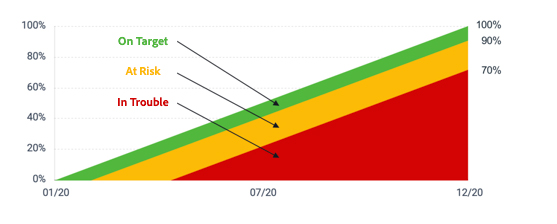

# Berechnung des Zielfortschritts

[!DNL Workfront Goals] berechnet den Zielfortschritt und zeigt die folgenden Informationen an:

* **Tatsächliche prozentuale Fertigstellung**—Wie viel des Ziels wurde tatsächlich bisher erreicht? Dieser Wert ist der Durchschnitt der vollständigen Prozentwerte aller mit dem Ziel verbundenen Fortschrittsanzeigen.
* **Erwartetes Prozent abgeschlossen**—Wie viel des Ziels zu diesem Zeitpunkt erreicht werden sollte, damit das Ziel rechtzeitig erreicht werden kann. Dieser Wert wird durch die Dauer des Ziels (Gesamtanzahl der Tage) und den aktuellen Zeitpunkt (Gesamtanzahl der Tage, die seit dem Zielstartdatum vergangen sind) berechnet.
* **Fortschritt**—Der Fortschritt ist ein Titel, der angibt, ob das Ziel auf Zielebene rechtzeitig erreicht werden soll oder ob es gefährdet ist oder nicht abgeschlossen werden kann.

![Screenshot des Zielfortschritts in [!DNL Workfront Goals]](assets/13-workfront-goals-percent-complete.png)

Die folgende Tabelle zeigt die Beziehung zwischen den Zielfortschrittsbeschriftungen und dem Fortschrittsprozentsatz:

Der Fortschritt Ihres Ziels ist ein guter Weg, um eine Vorstellung davon zu erhalten, wo sich Ihr Ziel befindet, um die Fertigstellung auf der Grundlage von Aktualisierungen zu erreichen, die Sie in das System einführen. Deshalb ist es so wichtig, Ihre Aktivitäten und Ergebnisse in Zielsetzungen zu aktualisieren. Mit Fortschrittsbeschriftungen können Sie dem Rest der Organisation einen standardisierten Status mitteilen.

![Eine Grafik, die die verschiedenen Fortschrittsbeschriftungen in [!DNL Workfront Goals]](assets/15-workfront-goals-progress-bar-code.png)

>[!TIP]
>
>Weitere Informationen zu den Formeln zur Berechnung des Zielfortschritts finden Sie in diesem Artikel: [Übersicht über den Zielfortschritt und die Bedingungen in Adobe Workfront-Zielen](https://experienceleague.adobe.com/docs/workfront/using/adobe-workfront-goals/goal-management/calculate-goal-progress.html?lang=en#overview-of-goal-progress-and-threshold).

