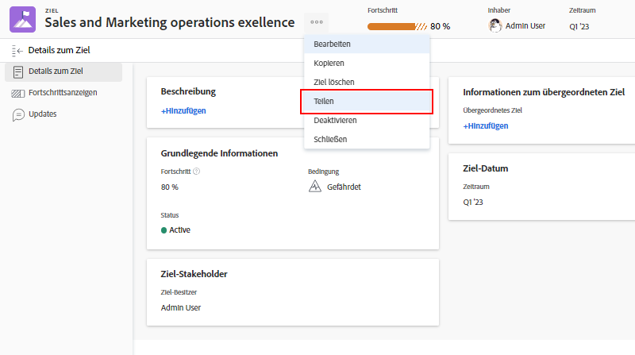

# Kommunizieren des Zielstatus

Nachdem Sie nun Ihre Ziele aktualisiert haben, nehmen Sie sich einen Moment Zeit, um die Ziele, an denen Sie arbeiten, aus der Vogelperspektive zu betrachten und zu sehen, wie sie mit den Zielen des Teams, der Gruppe und des Unternehmens zusammenhängen. Die Kommunikation mit anderen über den Fortschritt und den Status Ihrer Ziele ist wichtig für die korrekte Ausrichtung.

Es gibt verschiedene Möglichkeiten, um die richtigen Personen über Ihre Ziele auf dem Laufenden zu halten. Sie können wie folgt beginnen:

* Austausch und Berichterstellung über Ihre Ziele
* Nutzung des Bereichs [!UICONTROL Diagramme], um einen schnellen Überblick über den Fortschritt Ihrer Ziele zu erhalten

## Teilen eines Ziels

Sie können ein von Ihnen oder von einer anderen Person erstelltes Ziel teilen, für das Sie eine Verwaltungsberechtigung besitzen. Sie können Ziele nicht mit Gruppen, Teams oder Unternehmen teilen. Wenn Sie über eine Verwaltungsberechtigung für ein Ziel verfügen, können Sie die Zielberechtigungen für die Person, die das Ziel erstellt hat, ändern. Standardmäßig hat die Person, die das Ziel erstellt, eine Verwaltungsberechtigung, aber Sie können sie zu „Ansicht“ ändern.

1. Klicken Sie in einem beliebigen Abschnitt des [!DNL Goals]-Bereichs auf den Namen des freizugebenden Ziels, um das Bedienfeld [!UICONTROL Zieldetails] zu öffnen.

1. Klicken Sie auf das 3-Punkte-Symbol neben dem Namen des Ziels und dann auf [!UICONTROL **Teilen**]. Das Feld [!UICONTROL Zielzugriff] wird angezeigt.

   

1. Führen Sie einen der folgenden Schritte aus:

   * Wählen Sie die Einstellung [!UICONTROL Systemweit verwalten], um allen Personen im System, die über ihre [!DNL Workfront]-Zugriffsebene Zugriff auf [!DNL Goals] haben, eine Verwaltungsberechtigung zu geben. Diese Option ist für alle neuen Ziele standardmäßig deaktiviert.
   * Beginnen Sie mit der Eingabe der Namen der Benutzenden, denen Sie die Berechtigung [!UICONTROL Verwalten] geben möchten, in das Feld [!UICONTROL Verwaltungsberechtigung erteilen an]. Wählen Sie den Namen aus, wenn er in der Liste angezeigt wird.

1. Klicken Sie auf [!UICONTROL **Teilen**]. Die Beschriftung „systemweit“ oder die Namen der Benutzenden, die über eine Verwaltungsberechtigung für das Ziel verfügen, werden im Feld [!UICONTROL Zugriff auf „Verwalten“] im Bedienfeld [!UICONTROL Zieldetails] angezeigt.

## Bericht zu Zielinformationen

Sie können in [!DNL Workfront] Zielberichte oder Projektberichte erstellen, die Informationen über die zugehörigen Ziele enthalten. Es gibt mehrere Möglichkeiten, Zielinformationen in Berichten anzuzeigen.

* Erstellen Sie einen Zielbericht im Bereich „Berichte“. Im Zielbericht können Sie verschiedene Informationen über das Ziel anzeigen (z. B. Name, Inhaberin oder Inhaber, Daten, Fortschritt usw.), wozu folgende gehören:

   * **Zielhierarchie** – Zeigt alle übergeordneten Ziele und deren Verbindungen miteinander an.
   * **Ist Unternehmensziel** – Zeigt an, ob Ihre Organisation als Inhaber eines Ziels benannt ist.
   * **Inhabertyp** – Gibt an, ob der Inhaber eines Ziels ein Benutzer oder eine Benutzerin, ein Team oder eine Gruppe ist.

* Erstellen Sie einen Projektbericht, der Zielinformationen anzeigt, einschließlich der folgenden:
   * **Zielhierarchie** – Zeigt alle übergeordneten Ziele und deren Verbindungen miteinander an.
   * **Ziele** – Dies ist ein Sammlungsfeld, das alle mit einem Projekt verknüpften Ziele anzeigt.
   * **Anzahl der verlinkten Ziele** – Die Anzahl der mit dem Projekt verknüpften Ziele.
