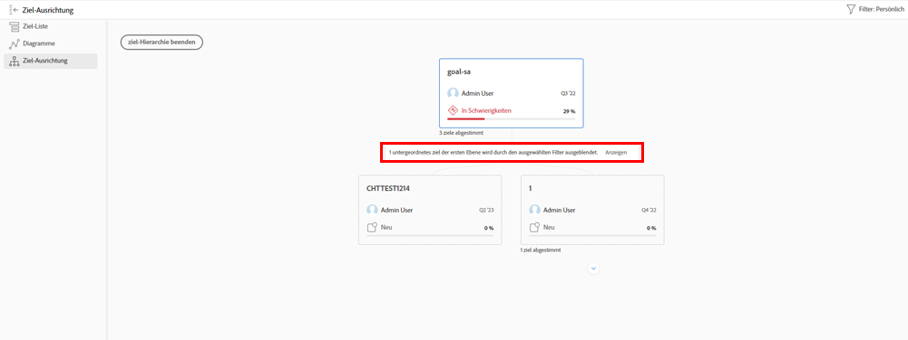

# Anzeigen einzelner Zielaktualisierungen

In diesem Video erfahren Sie, wie Sie:

* Zeigen Sie Ihre individuellen Ziele im [!UICONTROL Puls] Aktualisierungsstream

>[!VIDEO](https://video.tv.adobe.com/v/335200/?quality=12&learn=on)

## Filtern von Informationen in Ihrem Pulsstrom

Sie werden feststellen, dass Sie manchmal zu viele Informationen in der [!UICONTROL Puls] Streamen oder vielleicht nicht die richtigen Informationen. Filtern Sie die Informationen in Ihrem Feed, um genau zu sehen, was Sie möchten oder benötigen.

1. Klicken [!UICONTROL **Puls**] im linken Bereich.
1. Klicken Sie auf [!UICONTROL **Filter**] rechts oben.
1. Wählen Sie eine Option zum Filtern aus. Der Filter Alle wird standardmäßig angewendet und zeigt alle Ziele in Ihrem System an. Sie können einen der folgenden Schritte ausführen:

   * Wählen Sie einen der vordefinierten Filter aus, die unter dem [!UICONTROL Gespeichert] Bereich des Filterbedienfelds, um Ziele für Inhaber anzuzeigen (d. h. [!UICONTROL Alle], [!UICONTROL Persönlich], [!UICONTROL Meine Teams], [!UICONTROL Meine Gruppen]und [!UICONTROL Firma]).
   * Bewegen Sie den Mauszeiger über den Namen eines Filters und klicken Sie auf **Bearbeiten** neben dem Namen, um es anzupassen und spezifische Namen von Benutzern, Teams, Gruppen oder dem Namen Ihrer Organisation hinzuzufügen.
   * Klicken [!UICONTROL **Neuer Filter**] , um einen neuen Filter zu erstellen, wählen Sie aus der Liste der Optionen aus, nach denen Sie ihn anpassen und filtern möchten. [!UICONTROL Zeitraum], [!UICONTROL Status], [!UICONTROL Fortschritt]und/oder [!UICONTROL Inhaber].

   ![Ein Bild der [!UICONTROL Filter] Bedienfeld in [!DNL Workfront Goals]](assets/18-workfront-goals-pulse-stream.png)

**Hinweis:** Ihre Filterauswahl bleibt erhalten und die Informationen in anderen Abschnitten von [!DNL Goals] wird entsprechend diesen Informationen angezeigt. Sie können Ziele in verschiedenen Abschnitten der [!DNL Goals] Gebiet in [!DNL Workfront]:

* [!UICONTROL Liste der Ziele]
* [!UICONTROL Diagramme]
* [!UICONTROL Impuls]
* [!UICONTROL Ziel-Ausrichtung]. In diesem Abschnitt können Sie vorübergehend die Ziele anzeigen, die nicht mit dem angewendeten Filter übereinstimmen, sodass Sie das vollständige Bild aller ausgerichteten Ziele erhalten. Klicken Sie auf [!UICONTROL **Anzeigen/Anzeigen**] Option , wenn Ziele durch den ausgewählten Filter ausgeblendet werden.

   
