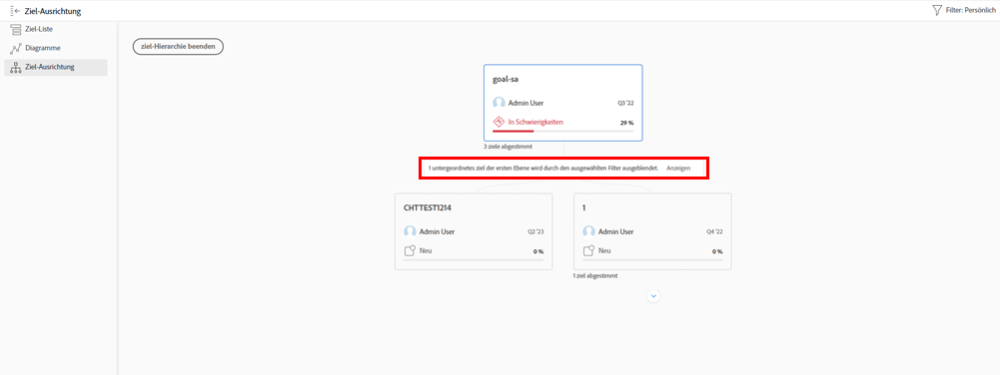

# Anzeigen einzelner Zielaktualisierungen

In diesem Video lernen Sie Folgendes:

* Zeigen Sie Ihre individuellen Ziele im Aktualisierungsverlauf von [!UICONTROL Pulse] an

>[!VIDEO](https://video.tv.adobe.com/v/335200/?quality=12&learn=on&enablevpops=1)

## Filtern von Informationen in Ihrem Verlauf von Pulse

Sie werden feststellen, dass Sie im Verlauf von [!UICONTROL Pulse] manchmal zu viele Informationen oder vielleicht nicht die richtigen Informationen erhalten. Filtern Sie die Informationen in Ihrem Feed, um genau das zu sehen, was Sie möchten oder benötigen.

1. Klicken Sie auf [!UICONTROL **Pulse**] im linken Bereich.
1. Klicken Sie auf das Symbol für [!UICONTROL **Filter**] rechts oben.
1. Wählen Sie eine Filteroption aus. Der Filter „Alle“ wird standardmäßig angewendet und zeigt alle Ziele in Ihrem System an. Sie können einen der folgenden Schritte ausführen:

   * Wählen Sie einen der vordefinierten Filter aus, die unter dem Bereich [!UICONTROL Gespeichert] des Filterbedienfelds aufgeführt sind, um Ziele für Inhaber anzuzeigen (d. h. [!UICONTROL Alle], [!UICONTROL Persönlich], [!UICONTROL Meine Teams], [!UICONTROL Meine Gruppen] und [!UICONTROL Firma]).
   * Bewegen Sie den Mauszeiger über den Namen eines Filters und klicken Sie auf **Bearbeiten** neben dem Namen, um ihn anzupassen und spezifische Namen von Benutzenden, Teams, Gruppen oder dem Namen Ihrer Organisation hinzuzufügen.
   * Klicken Sie auf [!UICONTROL **Neuer Filter**], um einen neuen Filter zu erstellen, und wählen Sie aus der Liste die Optionen aus, nach denen Sie ihn anpassen und filtern möchten. Zu den Optionen gehören: [!UICONTROL Zeitraum], [!UICONTROL Status], [!UICONTROL Fortschritt], und/oder [!UICONTROL Inhaber].

   ![Ein Bild des Bedienfelds [!UICONTROL Filter] in [!DNL Workfront Goals]](assets/18-workfront-goals-pulse-stream.png)

**Hinweis:** Ihre Filterauswahl bleibt erhalten und die Informationen in anderen Abschnitten von [!DNL Goals] werden entsprechend diesen Informationen angezeigt. Sie können in verschiedenen Abschnitten des Bereichs [!DNL Goals] in [!DNL Workfront] nach Zielen suchen und sie filtern:

* [!UICONTROL Liste der Ziele]
* [!UICONTROL Diagramme]
* [!UICONTROL Impuls]
* [!UICONTROL Ziel-Ausrichtung]. In diesem Abschnitt können Sie vorübergehend die Ziele anzeigen, die nicht mit dem angewendeten Filter übereinstimmen, sodass Sie das vollständige Bild aller ausgerichteten Ziele erhalten. Klicken Sie auf die Option [!UICONTROL **Anzeigen**], wenn Ziele durch den ausgewählten Filter ausgeblendet werden.

  
