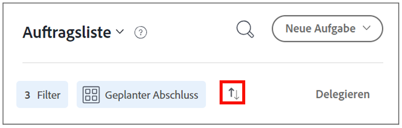

# Organisieren Sie Ihre Aufgabenlisten auf der [!DNL Workfront] [!UICONTROL Startseite]

>[!NOTE]
>
>Die Option [!UICONTROL [!DNL Sort by]] in der [!UICONTROL Arbeitsliste] wurde in ]Gruppieren nach[!UICONTROL  umbenannt, und Aufgaben und Probleme können auch nach ihrem [!UICONTROL geplanten Startdatum] gruppiert werden.

In diesem Video lernen Sie Folgendes:

* Sortieren von Arbeitsaufträgen
* Filtern von Arbeitsaufträgen nach Typ
* Identifizieren von startbereiter Arbeit
* Akzeptieren von Arbeitsaufträgen

>[!VIDEO](https://video.tv.adobe.com/v/335099/?quality=12&learn=on)

>[!NOTE]
>
>Standardmäßig werden die am frühesten fälligen Elemente oben in der [!UICONTROL Auftragsliste] angezeigt. Wenn Sie möchten, dass Ihre Arbeitselemente in absteigender Reihenfolge angezeigt werden, klicken Sie auf die Pfeile rechts neben dem Bereich „Gruppieren nach“.

