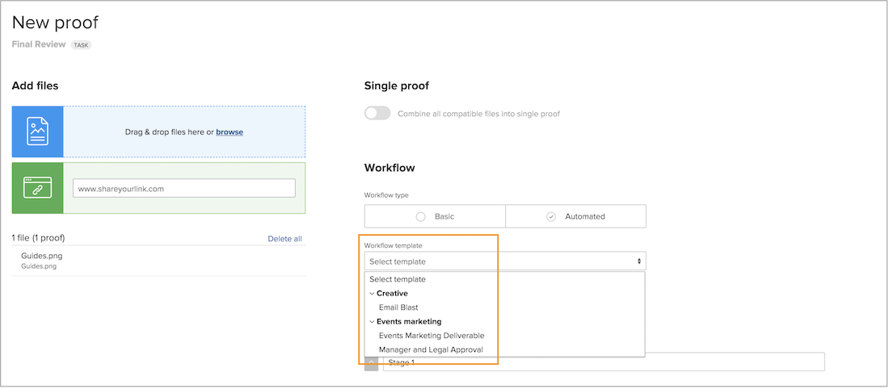

# Erstellen von Vorlagengruppen, um automatisierte Workflow-Vorlagen zu organisieren

Bevor Sie mit dem Erstellen von Vorlagen für automatisierte Workflows beginnen, empfiehlt [!DNL Workfront], dass Sie Vorlagengruppen erstellen, um die Vorlagen zu organisieren. Stellen Sie sich Gruppen als Behälter vor, in denen die verschiedenen Vorlagen aufbewahrt werden. Sie sind hilfreich, wenn Sie mehrere Teams oder Abteilungen haben, die Proofing verwenden, da Gruppen dafür sorgen, dass Vorlagen organisiert bleiben. Durch sie wird nämlich für die Personen, die Überprüfungs- und Genehmigungsprozesse zuweisen, ersichtlich, welche Vorlagen verwendet werden sollten.

Wenn Sie sich noch nicht sicher sind, wie Sie Vorlagen in Gruppen organisieren möchten, können Sie die Gruppeninformationen später hinzufügen. Am einfachsten ist es jedoch, gleich beim Erstellen einer Vorlage eine Vorlagengruppe zuzuweisen.

Diese Gruppen werden nicht nur in den Korrekturabzugs-Einrichtungen angezeigt, sondern auch beim Auswählen einer Vorlage, wenn ein Korrekturabzug-Workflow angewendet wird. Die fett gedruckten Begriffe in der Vorlagenliste sind die Gruppen.

Vorlagengruppen sind optional. Wenn Ihr Unternehmen nur über ein paar wenige Vorlagen verfügt, brauchen Sie diese wahrscheinlich nicht in Gruppen zu organisieren.

**So erstellen Sie eine Vorlagengruppe**

1. Wählen Sie **[!UICONTROL Proofing]** aus dem **[!UICONTROL Hauptmenü]** in [!DNL Workfront] aus.
1. Wählen Sie **[!UICONTROL Kontoeinstellungen]** aus, sobald der Bereich „Proofing-Setups“ geöffnet ist.
1. Navigieren Sie zu **[!UICONTROL Workflows]** im Menü des linken Bedienfelds.
1. Wählen Sie mit der Schaltfläche **[!UICONTROL Neu]** die Option **[!UICONTROL Neue Vorlagengruppe]** aus.
1. Benennen Sie die Gruppe.
1. Klicken Sie außerhalb des Feldes, um zu speichern.

Die neue Gruppe wird nun in der Liste angezeigt.

## Löschen einer Gruppe

Wenn Sie eine Gruppe löschen, die Vorlagen enthält, werden diese Vorlagen beibehalten und in eine generische Gruppe namens „[!UICONTROL Workflow-Vorlagen]“ verschoben. Sie können die Vorlagen bei Bedarf in andere Gruppen verschieben.

<!--
Learn More Icon
Create and manage Automated Workflow templates
-->
