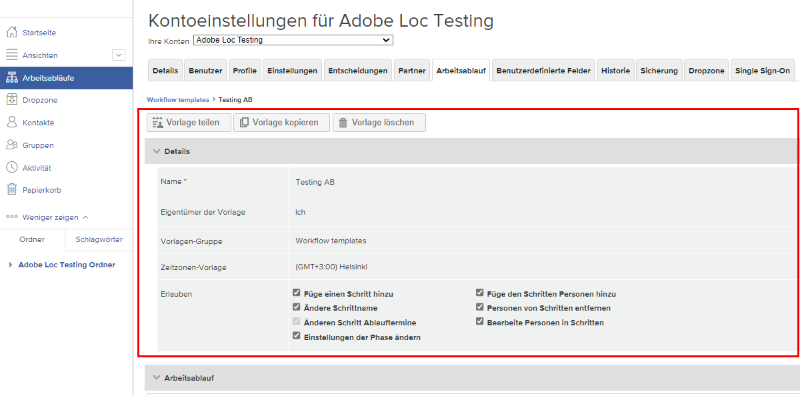
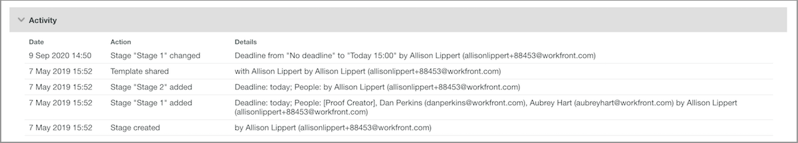

# Bearbeiten einer automatisierten Workflow-Vorlage

Wenn Prüf- und Genehmigungsprozesse für Korrekturabzüge präzisiert oder organisatorische Änderungen vorgenommen werden, sollten die automatisierten Workflow-Vorlagen aktualisiert werden, um die aktuellen Abläufe in Ihren Teams widerzuspiegeln, die Workfront verwenden.

Indem Sie die Vorlagen immer auf dem neuesten Stand halten, sorgen Sie für Konsistenz in Ihren Überprüfungs- und Genehmigungsprozessen und sparen denjenigen Zeit, die die Korrekturabzüge hochladen, da sie den Workflow nicht ständig anpassen müssen.

1. Wählen Sie **[!UICONTROL Proofing]** aus dem **[!UICONTROL Hauptmenü]** in [!DNL Workfront] aus.
1. Wählen Sie dort im Menü des linken Bedienfelds **[!UICONTROL Workflows]** aus.
1. Klicken Sie auf das Drei-Punkte-Menü ganz rechts neben dem Namen der Vorlage und wählen Sie **[!UICONTROL Vorlagendetails anzeigen]** aus.

Die Optionen zum Freigeben, Kopieren und Löschen der Vorlage befinden sich am oberen Rand des Fensters mit den Vorlagendetails für jede Vorlage. Das Löschen einer Vorlage wirkt sich nicht auf laufende Korrekturabzüge aus, auf die diese Vorlage angewendet wurde, aber es bedeutet, dass die Vorlage nicht mehr verwendet werden kann.

Klicken Sie auf den Pfeil links neben dem Wort [!UICONTROL Details], um den Abschnitt zu erweitern oder auszublenden.

## Vornehmen von Änderungen an Abschnitten und Empfängerinnen bzw. Empfängern

Änderungen können im Bereich [!UICONTROL Workflow] erforderlich sein, wenn ein gestraffter Prozess einen früheren Abgabetermin bedeutet oder wenn jemand zum Team stößt und die Korrekturabzüge überprüfen wird.

Jeder Schritt eines automatisierten Workflows hat seinen eigenen Bereich, in dem Fristen, Datenschutz, Empfängerinnen und Empfänger von Korrekturabzügen und andere Informationen unabhängig voneinander geändert werden können.

In diesem Video werden einige der Änderungen vorgestellt, die Sie im Bereich [!UICONTROL Workflow] vornehmen können. Eine Übersicht über diese Einstellungen finden Sie in der Aufzählung unter diesem Video.

>[!VIDEO](https://video.tv.adobe.com/v/3432614/?quality=12&learn=on&enablevpops&captions=ger)

Im Folgenden finden Sie eine Übersicht über die Änderungen, die Sie an der Korrekturabzug-Vorlage im Abschnitt [!UICONTROL Workflow] vornehmen können:

* Klicken Sie in das Feld „Name der Phase“ oder in das Feld „Frist“, um diese Informationen zu aktualisieren.
* Klicken Sie auf den Pfeil neben der „Frist“, um die Phase zu sperren, um zu bestimmen, wann diese Phase aktiviert wird, oder nur um eine Entscheidung zu verlangen.
* Klicken Sie in der Empfängerliste in die Felder [!UICONTROL Rolle] oder [!UICONTROL E-Mail-Warnmeldungen], um eine andere Option auszuwählen.
* Gehen Sie auf das Drei-Punkte-Menü ganz rechts neben dem Namen einer Empfängerin bzw. eines Empfängers, um sie bzw. ihn aus der Liste zu löschen, zur Hauptentscheidungsperson für diese Workflow-Phase zu machen oder die Informationen für Korrekturabzug-Rolle und E-Mail-Warnmeldungen zu bearbeiten.
* Sie haben zwei Möglichkeiten, Empfängerinnen und Empfänger in die Liste aufzunehmen.
   1. Gehen Sie in der oberen rechten Ecke im Abschnitt der jeweiligen Phase zum Menü [!UICONTROL Mehr] und wählen Sie [!UICONTROL Personen zur Phase hinzufügen] aus. Sobald Sie das Fenster [!UICONTROL Personen zur Phase hinzufügen] geöffnet haben, klicken Sie auf die Phase, zu der Sie eine Person hinzufügen möchten. Geben Sie dann den Namen oder die E-Mail-Adresse der Person in die Empfängerliste ein und weisen Sie ihr eine Korrekturabzug-Rolle und eine E-Mail-Warnmeldung zu. Klicken Sie auf die Schaltfläche [!UICONTROL Personen hinzufügen], wenn Sie fertig sind.
   1. Wählen Sie oben im Bereich [!UICONTROL Workflow] die Option [!UICONTROL Personen zum Schritt hinzufügen] aus.

## Freigeben von Vorlagen

Der Bereich [!UICONTROL Freigegeben für] zeigt die Benutzenden eines Korrekturabzugs an, die die Vorlage verwenden können. Entfernen Sie Personen, die die Vorlage nicht mehr benötigen, indem Sie auf das Drei-Punkte-Menü ganz rechts neben ihrem Namen klicken und [!UICONTROL Entfernen] auswählen.

Liste ![[!UICONTROL Freigegeben für]](assets/proof-system-setups-edit-template-shared-with.png)

In diesem Bereich können Sie jedoch keine Personen zur Freigabeliste hinzufügen. Gehen Sie dazu zurück an den oberen Rand des Fensters mit den Vorlagendetails und klicken Sie auf die Schaltfläche [!UICONTROL Vorlage freigeben].

## Weitere Informationen

[!DNL Workfront] führt ein Protokoll darüber, wann Änderungen an der Vorlage vorgenommen wurden. Sie können das Datum sehen, wer die Änderung vorgenommen hat und einige kurze Informationen über die vorgenommenen Änderungen.

In diesem Abschnitt werden keine Informationen darüber gespeichert, wann die Vorlage für Korrekturabzüge verwendet wurde.

