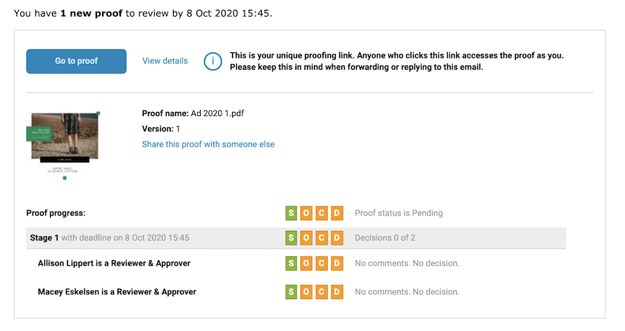

# Informationen zu E-Mail-Warnungen und Testversandbenachrichtigungen

E-Mail-Warnungen unterscheiden sich von Testversand-Benachrichtigungs-E-Mails. Sie erhalten eine Benachrichtigungs-E-Mail über einen Testversand, wenn Ihnen ein neuer Testversand zur Überprüfung zugewiesen wurde, wenn ein Testversand verspätet ist oder wenn eine neue Version des Testversands vorliegt, den Sie sich ansehen können.

Wenn Sie die Benachrichtigungsoption beim Hochladen eines Testversands deaktivieren, erhält niemand eine Mitteilung von [!DNL Workfront] , dass es einen neuen zu überprüfenden Nachweis gibt.

E-Mail-Warnhinweise werden pro Validierer/Genehmiger festgelegt, meistens beim Hochladen des Testversands. Sie können Ihren Testversand-Empfängern einen Standard-E-Mail-Warnhinweistyp zuweisen, damit Sie ihn nicht jedes Mal festlegen müssen, wenn Sie einen Testversand hochladen. Wenden Sie sich an Ihren Systemadministrator, wenn Sie wissen möchten, wie diese Standardeinstellungen festgelegt wurden.

Auch wenn E-Mail-Warnungen auf [!UICONTROL Behinderte], werden die Testversand-Empfänger weiterhin über einen neuen Testversand oder eine neue Version informiert.

<!--
# Learn more
* New proof email
* Late proof email
-->
