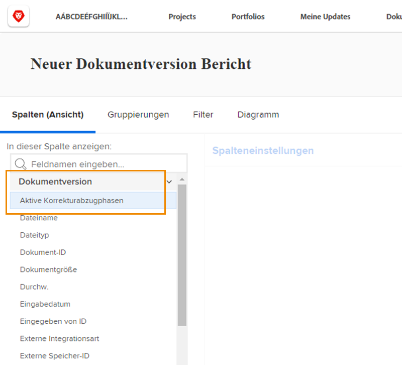
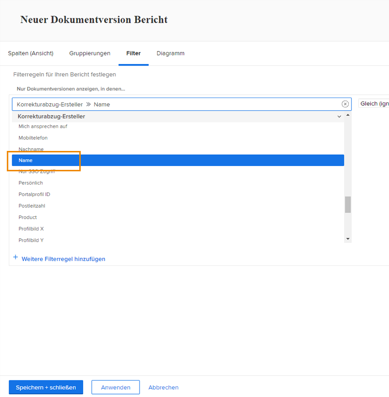

# Bericht zu Testsendungen

[!DNL Workfront]Dank der digitalen Testversandfunktionen können Sie Projekte und damit verbundene Prüfungs-Workflows zentral verwalten — [!DNL Workfront]. Verschaffen Sie sich wertvolle Einblicke in die Testarbeiten, die mit Berichtstypen, Feldquellen und Feldnamen durchgeführt werden, die Überprüfungs- und Genehmigungsinformationen anzeigen.

Es wird empfohlen, mit Ihrem [!DNL Workfront] Berater erstellen, um Berichte zu erstellen, die den Anforderungen Ihres Unternehmens entsprechen. Einige Berichte müssen mit [!DNL Workfront]Die Textmodusberichterstellung.

Beginnen Sie mit diesen einfachen, standardmäßigen Berichten, die Ihren Teams bei der Verwaltung von Testsendungen helfen, die während eines Prüfungs- und Genehmigungsprozesses in [!DNL Workfront].

## [!UICONTROL Korrekturabzug-Genehmigung]

Mit diesem Berichtstyp können Sie ausstehende Testversandgenehmigungen verfolgen, um sicherzustellen, dass die Fristen eingehalten werden.

![Auswählen [!UICONTROL Validierung des Testversands] von [!UICONTROL Neuer Bericht] Dropdown-Menü](assets/proof-system-setups-proof-approval-report.png)

Zu den Filteroptionen gehören [!UICONTROL Entscheidungsdatum], [!UICONTROL Validierung des Testversands], [!UICONTROL Validierungsphase], [!UICONTROL Workflow-Vorlage]und [!UICONTROL Anforderungsinformationen]. Bei der Berichterstellung für den Textmodus können Sie eine Gruppierung erstellen, die die Liste nach Dokumentnamen organisiert. Siehe [Grundlegendes zum Textmodus für Gruppierungen](https://experienceleague.adobe.com/docs/workfront-learn/tutorials-workfront/reporting/intermediate-reporting/basic-text-mode-for-groupings.html?lang=en).

Stellen Sie beim Schreiben von Berichten zur Testversandvalidierung sicher, dass Sie Informationen zur aktuellsten Testversion erhalten. [!DNL Workfront] empfiehlt, diese Feldquelle und den Feldnamen in den Filter einzuschließen:

**[!UICONTROL Validierung des Testversands]>>[!UICONTROL Ist aktuelle Dokumentversion]**

Dies ist nützlich, wenn Sie Berichte zu Testsendungen erstellen, die mehrere Versionen aufweisen, sodass der Bericht nur die aktuelle Version jedes Testversands auflistet, für den eine Genehmigung erforderlich ist. Dadurch werden die früheren Versionen herausgefiltert, an denen Sie nicht mehr arbeiten müssen.

## [!UICONTROL Dokumentversion]

Mit diesem Berichtstyp können Sie Versionen in [!DNL Workfront].

![Auswählen [!UICONTROL Dokumentversion] von [!UICONTROL Neuer Bericht] Dropdown-Menü](assets/proof-system-setups-document-version-report.png)

Zu den Anzeigeoptionen gehören Informationen aus dem [!UICONTROL Dokumentversion], [!UICONTROL Dokument], [!UICONTROL durch], [!UICONTROL Validierungsstatus des Testversands], [!UICONTROL Testversand]und [!UICONTROL Dokumentanbieter].

Gruppierungen können durch [!UICONTROL Dokumentversion], [!UICONTROL durch], [!UICONTROL Validierungsstatus des Testversands]oder Informationen zum Testversand-Eigentümer.

Zu den Filtern gehören [!UICONTROL Dokumentversion], [!UICONTROL Zugriffsstufe], [!UICONTROL Dokument], [!UICONTROL durch], [!UICONTROL Validierungsstatus des Testversands], [!UICONTROL Testversand]und Informationen des Dokumentenanbieters.

Sie können den Namen der Testphase anzeigen, die derzeit für jedes Dokument im Bericht mit dieser Spalte aktiv ist:

**[!UICONTROL Dokumentversionen] >> [!UICONTROL Aktive Testphase]**

Wenn derzeit keine Bühne aktiv ist, ist die Spalte leer.

Diese Feldquelle >> Feldname ist auch als Filter in einem Bericht verfügbar.

Verwenden Sie die [!UICONTROL Ersteller des Testversands] -Feldquelle, um Informationen über den Benutzer zu erhalten, der den Testversand erstellt hat. Wählen Sie die [!UICONTROL Name] -Feldquelle, um den Namen des Testversand-Erstellers in einer Ansicht anzuzeigen.

**[!UICONTROL Ersteller des Testversands] >> [!UICONTROL Name]**

Dieses Feld >> Feldname-Kombinationsfeld ist auch als Filter verfügbar.

<!--
Learn More Icon
Learn how to create reports in [!DNL Workfront] with the Report Creation class.
Access to proofing functionality
-->
