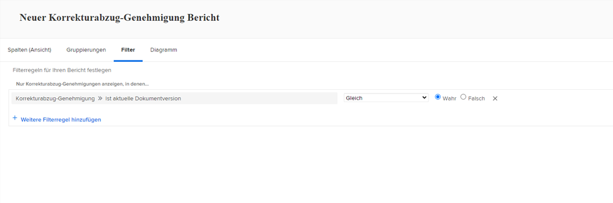

# Korrekturabzugsbericht

Mit den digitalen Proofing-Funktionen von [!DNL Workfront] können Sie Projekte und die dazugehörigen Überprüfungs-Workflows an einem Ort verwalten – [!DNL Workfront]. Verschaffen Sie sich mit Berichtstypen, Feldquellen und Feldnamen, die Überprüfungs- und Genehmigungsinformationen anzeigen, wertvolle Einblicke in die durchgeführte Proofing-Arbeit.

Wir empfehlen, mit Ihrer [!DNL Workfront]-Beraterin bzw. Ihrem -Berater zusammenzuarbeiten, um Berichte zu erstellen, die den Anforderungen Ihres Unternehmens entsprechen. Einige der Berichte erfordern Kenntnisse im Umgang mit dem Textmodus von [!DNL Workfront].

Beginnen Sie mit diesen grundlegenden Standardberichten, um Ihre Teams bei der Verwaltung von Korrekturabzügen zu unterstützen, die einen Überprüfungs- und Genehmigungsprozess in [!DNL Workfront] durchlaufen.

## [!UICONTROL Korrekturabzug-Genehmigung]

Mit diesem Berichtstyp können Sie ausstehende Korrekturabzugsgenehmigungen verfolgen, um sicherzustellen, dass die Fristen eingehalten werden.

![Wählen Sie [!UICONTROL Korrekturabzug-Genehmigung] aus dem Dropdown-Menü [!UICONTROL Neuer Bericht]](assets/proof-system-setups-proof-approval-report.png)

Zu den Ansichts- und Filteroptionen gehören [!UICONTROL Entscheidungsdatum], [!UICONTROL Korrekturabzug-Genehmigung], [!UICONTROL Genehmigungsstufe], [!UICONTROL Workflow-Vorlage] und [!UICONTROL Informationen zur anfragenden Person]. Bei der Berichterstellung im Textmodus können Sie eine Gruppierung erstellen, die die Liste nach Dokumentennamen organisiert. Siehe [Informationen zum grundlegenden Textmodus für Gruppierungen](https://experienceleague.adobe.com/docs/workfront-learn/tutorials-workfront/reporting/intermediate-reporting/basic-text-mode-for-groupings.html?lang=de).

Achten Sie bei der Erstellung von Korrekturabzugsgenehmigungsberichten darauf, dass Sie Ihnen Informationen aus der aktuellsten Version der Korrekturabzüge vorliegen. [!DNL Workfront] empfiehlt, diese Feldquelle und den Feldnamen in den Filter einzuschließen:

**[!UICONTROL Korrekturabzug-Genehmigung]>>[!UICONTROL Ist die aktuelle Version des Dokuments]**

Dies ist nützlich, wenn Sie Berichte zu Korrekturabzügen erstellen, die mehrere Versionen haben, damit der Bericht nur die aktuelle Version jedes Korrekturabzugs auflistet, der genehmigt werden muss. Dadurch werden die früheren Versionen herausgefiltert, an denen Sie nicht mehr arbeiten müssen.

## [!UICONTROL Dokumentversion]

Mit diesem Berichtstyp können Sie Versionen in [!DNL Workfront] verwalten und verfolgen.

![Wählen Sie [!UICONTROL Dokumentversion] aus dem Dropdown-Menü [!UICONTROL Neuer Bericht]](assets/proof-system-setups-document-version-report.png)

Zu den Ansichtsoptionen gehören Informationen zu [!UICONTROL Dokumentversion], [!UICONTROL Dokument], [!UICONTROL eingegeben von], [!UICONTROL Status der Korrekturabzug-Genehmigung], [!UICONTROL Erstellerin bzw. Ersteller des Korrekturabzugs] und [!UICONTROL Dokumentanbieter].

Gruppierungen können nach [!UICONTROL Dokumentversion], [!UICONTROL eingegeben von], [!UICONTROL Status der Korrekturabzug-Genehmigung] oder Informationen zur Eigentümerin bzw. zum Eigentümer des Korrekturabzugs vorgenommen werden.

Zu den Filtern gehören [!UICONTROL Dokumentversion], [!UICONTROL Zugriffsebene], [!UICONTROL Dokument], [!UICONTROL eingegeben von], [!UICONTROL Status der Korrekturabzug-Genehmigung], [!UICONTROL Erstellerin bzw. Ersteller des Korrekturabzugs] und Informationen zum Dokumentanbieter.

In dieser Ansichtsspalte können Sie den Namen der Proofing-Stufe anzeigen, die derzeit für jedes Dokument im Bericht aktiv ist:

**[!UICONTROL Dokumentversionen] >> [!UICONTROL Aktive Korrekturabzugsphasen]**

Wenn derzeit keine Phase aktiv ist, ist die Spalte leer.

Feldquelle >> Feldname ist auch als Filter in einem Bericht verfügbar.

Verwenden Sie die Feldquelle [!UICONTROL Erstellerin bzw. Ersteller des Korrekturabzugs], um Informationen über die Person, die den Korrekturabzug erstellt hat, zu melden. Wählen Sie die Feldquelle [!UICONTROL Name], um den Namen der Person, die den Korrekturabzug erstellt hat, in einer Ansicht anzuzeigen.

**[!UICONTROL Erstellerin bzw. Ersteller des Korrekturabzugs] >> [!UICONTROL Name]**

Diese Kombination aus Feldquelle >> Feldname ist auch als Filter verfügbar.

<!--
Learn More Icon
Learn how to create reports in [!DNL Workfront] with the Report Creation class.
Access to proofing functionality
-->
