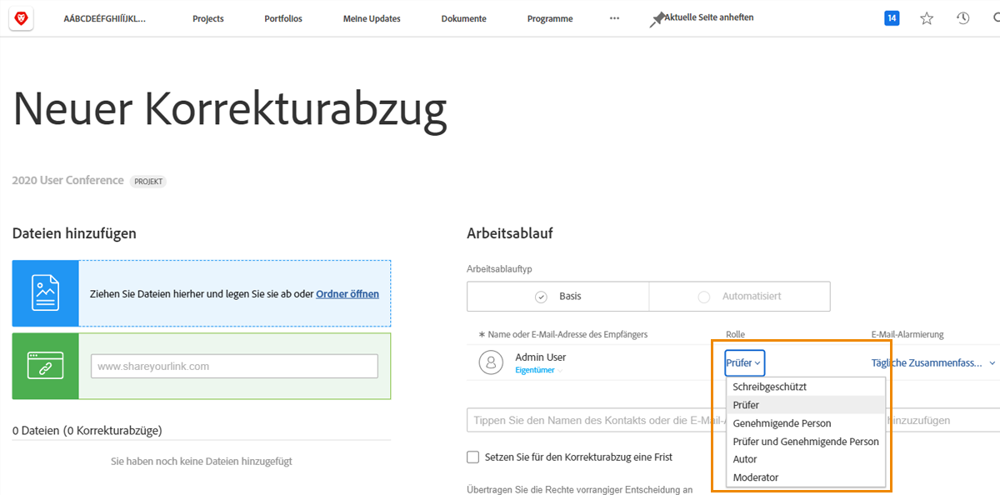
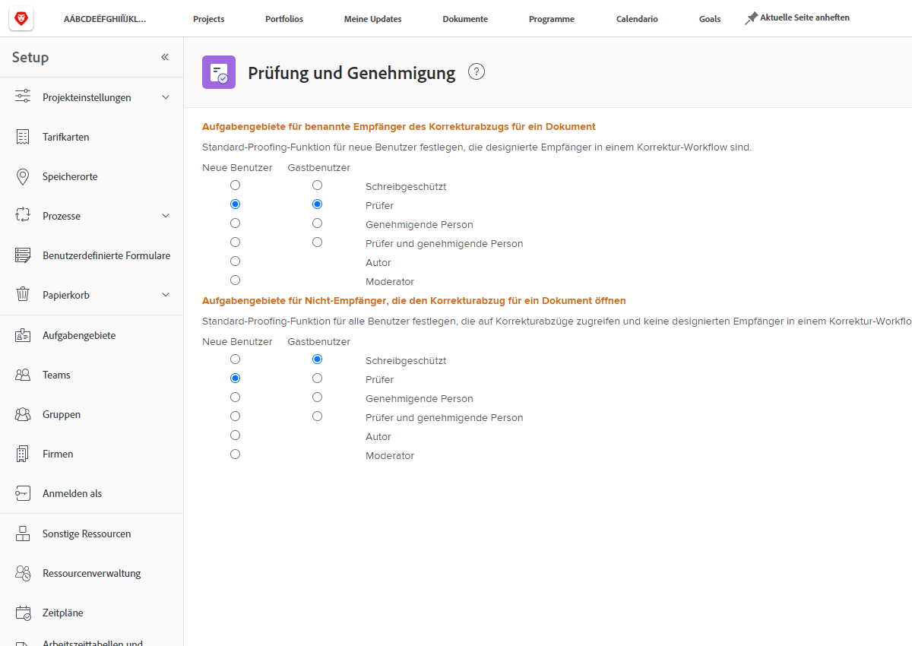

# Festlegen von Standard-Korrekturabzugsrollen

Die erste Standardeinstellung, die Sie vornehmen müssen, ist die Festlegung einer standardmäßigen Korrekturabzugsrolle, die zugewiesen wird, wenn neue Benutzende angelegt werden oder Personen einen Korrekturabzug öffnen.

Korrekturabzugsrollen legen fest, was Benutzende mit einem Korrekturabzug machen können – ihn nur ansehen, Kommentare abgeben, ihn genehmigen usw. [!DNL Workfront] empfiehlt, dass für alle Benutzenden Korrekturabzugsrollen festgelegt werden, um das Hinzufügen von Empfängerinnen und Empfängern zu Korrekturabzügen und die Einrichtung von Workflows zu beschleunigen und zu vereinfachen.

Diese standardmäßige Korrekturabzugsrolle kann jedoch geändert werden, wenn einzelne Korrekturabzüge hochgeladen werden, um sicherzustellen, dass alle in der Lage sind, die für sie erforderliche Rolle im Überprüfungs- und Genehmigungsprozess zu erfüllen.

## Festlegen von Standard-Korrekturabzugsrollen

1. Wählen Sie **Einrichtung** im [!UICONTROL Hauptmenü].
1. Wählen Sie **Überprüfung und Genehmigung** im linken Menü.
1. Klicken Sie auf die Schaltfläche neben der gewünschten standardmäßigen Korrekturabzugsrolle sowohl für neue [!DNL Workfront]-Benutzende als auch für Gastbenutzende von Korrekturabzügen als „designierte Empfänger“, d. h. alle Personen, die dem Korrekturabzug-Workflow entweder manuell oder über eine Workflow-Vorlage hinzugefügt werden.
1. Klicken Sie auf die Schaltfläche neben der gewünschten standardmäßigen Korrekturabzugsrolle sowohl für neue [!DNL Workfront]-Benutzende als auch für Gastbenutzende von Korrekturabzügen für „Nicht-Empfänger“-Benutzende. Dies sind in der Regel [!DNL Workfront]-Benutzende, die zwar Zugriff auf einen Korrekturabzug haben, aber nicht zu den Personen gehören, die dem Workflow zugewiesen sind.
1. Speichern Sie die Änderungen.

Überlegen Sie, was die meisten Ihrer Benutzenden und Gäste erwarten, wenn sie zu einem Proofing-Workflow hinzugefügt werden. Dies sollte Ihre Standardeinstellung sein.

## Best Practices

| Best Practice | Das sind die Gründe |
|---|---|
| Legen Sie in Workfront die Einstellung „Benutzerrollen für Nicht-Empfänger, die einen Dokument-Korrekturabzug öffnen“ auf „Schreibgeschützt“ oder „Prüfer“ fest. | Für die anderen Optionen dieser Einstellung muss eine Korrekturabzugsentscheidung getroffen werden, wodurch Ihr Proofing-Workflow gestört werden kann. Im Allgemeinen müssen Personen, die nicht zum Korrekturabzug-Workflow hinzugefügt werden, lediglich den Korrekturabzug ansehen oder Kommentare abgeben, den Korrekturabzug aber nicht tatsächlich genehmigen. Daher wählen Sie am besten die Optionen „Schreibgeschützt“ oder „Prüfer“ aus.    Hinweis: Diese Einstellung finden Sie im Workfront-Hauptmenü unter „Setup“ > „Überprüfung und Genehmigung“. |
