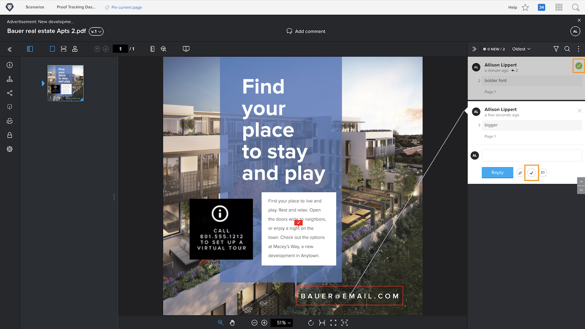

# Verwalten von Testversandkommentaren

[!DNL Workfront] hilft Ihnen beim Nachverfolgen und Verwalten von mit jedem Kommentar in einem Testversand zusammenhängenden Arbeiten, z. B. beim Durchführen von Korrekturen am Asset, durch Kommentar-Aktionen oder durch Beheben von Kommentaren.

Testaktionen sind eine &quot;Markierung&quot; oder eine &quot;Bezeichnung&quot; für einen Kommentar und werden häufig verwendet, um anzugeben, dass bezüglich des Kommentars eine Aktion durchgeführt wurde oder erforderlich ist. Aktionen können über das Symbol oder das Menü Mehr für jeden Kommentar ausgewählt werden.

Sie sind beispielsweise dafür verantwortlich, zu entscheiden, welche der während des Überprüfungsprozesses vorgenommenen Korrekturen tatsächlich durchgeführt werden sollen. Mithilfe einer Aktion können Sie die relevanten Kommentare markieren und einem Designer oder Editor mitteilen, welche Änderungen vorgenommen werden sollen. Diese Person kann dann eine andere Aktion verwenden, um anzugeben, dass die Änderungen vorgenommen wurden.

![Ein Bild eines Testversands im Testversand-Viewer mit der [!UICONTROL Aufgaben] Aktion zum Testen des Kommentars hervorgehoben.](assets/manage-comments-2.png)

Wenn Ihre Kommentare keine Aktionen enthalten, hat Ihr Unternehmen sie nicht eingerichtet. Wenden Sie sich an Ihren Testsystemadministrator, wenn Sie glauben, dass Aktionen etwas sind, das Ihr Unternehmen verwenden sollte.

Die Funktion &quot;Kommentar auflösen&quot;wird häufig verwendet, um anzugeben, dass ein Kommentar in irgendeiner Weise angesprochen wurde - es wurde eine Korrektur vorgenommen oder eine Frage wurde beantwortet. Einige [!DNL Workfront] -Kunden &quot;beheben&quot;einen Kommentar, wenn es sich um eine Korrektur handelt, die nicht vorgenommen werden muss, oder es ist nur ein Kommentar, der gelesen wurde.

Lösen Sie den Kommentar, indem Sie auf das Häkchensymbol klicken. Auf diese Weise wird ein grünes Häkchen auf den Kommentar gesetzt, sodass Sie leicht erkennen können, welche Kommentare geprüft wurden, während Sie die Spalte &quot;Kommentare&quot;durchsuchen.

Sie können die Spalte &quot;Kommentare&quot;nach beiden dieser Funktionen filtern, um zu kuratieren, was Sie bei der Arbeit mit dem Testversand sehen.

![Ein Bild der Kommentarfilter im Testversand-Viewer mit der [!UICONTROL Aktionen] und [!UICONTROL Allgemein] hervorgehobene Filteroptionen.](assets/manage-comments-3.png)

## Ihre Wendung

>[!IMPORTANT]
>
>Vergessen Sie nicht, alle Mitarbeiter, die einem Testversand-Workflow zugewiesen sind, daran zu erinnern, dass Sie im Rahmen Ihrer Workfront-Schulung mit Testsendungen arbeiten.

1. Suchen Sie einen Testversand, den Sie in Workfront hochgeladen haben. Öffnen Sie den Testversand-Viewer, um sich die Kommentare anzusehen, die abgegeben wurden, und um auf einen Kommentar zu antworten. Schließen Sie den Testversand-Viewer, wenn Sie fertig sind.
1. Verwenden Sie den Abschnitt Aktualisierungen - entweder im Bereich Dokumentdetails oder Zusammenfassung - , um die neuesten Kommentare zu einem in Workfront hochgeladenen Testversand anzuzeigen. Antworten Sie auf einen Kommentar.

<!--
## Learn more
* Create and manage proof comments
-->
