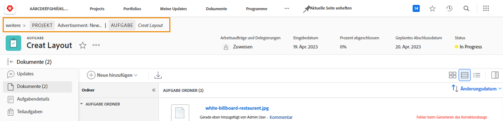

# Informationen zum Testversand

## Anzeigen von Testversand-Details

Als Testversandverantwortlicher oder -eigentümer können Sie die Details hinter einem Testversand im Zusammenfassungsfenster und im [!UICONTROL Dokumentdetails] Seite. Suchen Sie zunächst Ihren Testversand im [!UICONTROL Dokumente] -Abschnitt eines Projekts, einer Aufgabe oder eines Problems.

### Zusammenfassungsbereich

Das Zusammenfassungsfenster bietet einen allgemeinen Überblick über die grundlegenden Details des Testversands. Verwenden Sie das Symbol, um das Bedienfeld bei Bedarf zu erweitern und zu reduzieren, wenn dies nicht der Fall ist. Sie können sogar mit dem Mauszeiger über die Miniaturansicht des Testversands fahren, um ihn zu öffnen oder herunterzuladen.

![Ein Bild der [!UICONTROL Dokumente] -Abschnitt eines Projekts mit einem ausgewählten Testversand und erweitertem Zusammenfassungsfenster. Sowohl das Symbol des Zusammenfassungsbereichs als auch das Übersichtsbedienfeld sind hervorgehoben.](assets/document-summary.png)

Hinweis: Die [!UICONTROL Genehmigungen] -Abschnitt im Zusammenfassungsbereich finden Sie unter **Dokument** Genehmigungen und **ist nicht** gebunden an den Prozess der Überprüfung und Validierung von Testsendungen, über den Sie in diesem Kurs gelernt haben. Die beiden Prozesse sind separat in [!DNL Workfront].

### [!UICONTROL Dokumentdetails]

Wenn Sie weitere Informationen zum Testversand benötigen, wird die [!UICONTROL Dokumentdetails] -Link führt Sie zur &quot;Seite&quot;des Testversands unter [!DNL Workfront].

![Ein Bild der Testversand-Seite in [!DNL  Workfront].](assets/document-details.png)

Beachten Sie, dass die Möglichkeit, Informationen zum Testprozess anzuzeigen, von Ihren Testberechtigungen in [!DNL Workfront].

Auf der Seite des Testversands können Sie über das Menü im linken Bedienfeld auf diese Abschnitte zugreifen:

* **Aktualisierungen —** Kommentare aus dem Testversand-Viewer werden hier mit dem Tag &quot;Testversand-Kommentar&quot;angezeigt. Sie können auch Kommentare zur Datei abgeben, genau wie Sie Kommentare zu einer Aufgabe oder einem Projekt abgeben (diese Kommentare erscheinen nicht im Testversand-Viewer).
* **Genehmigungen —** Dieser Abschnitt richtet sich an Dokumentgenehmigungen, nicht an Testgenehmigungen. Die beiden Arten von Genehmigungen sind separate Prozesse in [!DNL Workfront] und nicht verknüpfen. Wenn Sie Testversand-Workflows für Ihre Überprüfungen und Genehmigungen verwenden, verwenden Sie diesen Abschnitt nicht.
* **Alle Versionen —** Verfolgen und verwalten Sie den Versionsverlauf des Testversands. Möglicherweise ist der Zugriff auf diese Informationen im Zusammenfassungsbereich im [!UICONTROL Dokumente] Liste.
* **Benutzerdefiniertes Forms —** Benutzerdefinierte Formulare werden bei Testsendungen verwendet, um unternehmensspezifische Informationen zu erfassen. Diese Informationen können mit der Datei an integrierte Dokumentenspeichersysteme wie [!DNL Workfront] DAM oder [!DNL Adobe’s] AEM. Benutzerdefinierte Formulare werden von Ihrem [!DNL Workfront] Systemadministrator oder Gruppenadministrator. Sprechen Sie mit Ihrem Team oder Ihren Administratoren, um zu erfahren, ob Sie benutzerdefinierte Formulare für Testsendungen verwenden werden.
* **Prüfungs-Workflow —** Verwalten oder ändern Sie den dem Testversand zugewiesenen Workflow. Sie können dieses Fenster mit dem [!UICONTROL Testversand-Workflow] auf dem Testversand im [!UICONTROL Dokumente] auch Liste. Erfahren Sie, wie Sie mit dem Video Workflow zum Bearbeiten eines Testversands Änderungen am Workflow vornehmen können.

Sehen wir uns zwei der Abschnitte genauer an: [!UICONTROL Testen der Viewer-Einstellungen] und [!UICONTROL Aktivität &quot;Testversand&quot;].

### [!UICONTROL Proofing-Viewer-Einstellungen]

Mithilfe dieser Einstellungen können Sie den Zugriff auf den Testversand selbst steuern.

![Ein Bild der [!UICONTROL Testen der Viewer-Einstellungen] von der Seite des Testversands mit der [!UICONTROL Testen der Viewer-Einstellungen] im Menü des linken Bedienfelds hervorgehoben.](assets/proofing-settings-on-details-page.png)

* **[!UICONTROL Anmeldung erforderlich. Dieser Testversand kann nicht für Gastbenutzer freigegeben werden] —** Der Testversand kann nur für Personen freigegeben werden, die über eine [!DNL Workfront] Testlizenz.
* **[!UICONTROL Elektronische Unterzeichnung von Entscheidungen erforderlich] —** Bei der Freigabe eines Testversands muss der Empfänger über Testversandberechtigungen in [!DNL Workfront] und macht sie &quot;elektronisch signieren&quot; den Testversand durch Eingabe ihres Testpassworts, wenn sie eine Testversandentscheidung treffen. (Hinweis: Das Testkennwort unterscheidet sich von Ihrem [!DNL Workfront] Kennwort. Das Kennwort zum Testen ist nicht leicht zugänglich, sodass die meisten Empfänger dieses Kennwort nicht kennen.) [!DNL Workfront] empfiehlt, mit Ihrem [!DNL Workfront] Berater vor der Verwendung dieser Funktion.
* **[!UICONTROL Sperren des Testversands, wenn alle erforderlichen Entscheidungen getroffen werden]—** Auf diese Weise wird der Beweis für alle weiteren Kommentare, Antworten, Entscheidungen usw. gesperrt, sobald jede Entscheidung über den Nachweis getroffen wurde. Dadurch wird die gesamte Testversand-Version gesperrt, nicht nur eine bestimmte Phase des Testversand-Workflows.
* **[!UICONTROL Herunterladen der Originaldatei zulassen] —** Testversand-Empfänger können die ursprüngliche Quelldatei des Testversands aus dem Testversand-Viewer herunterladen (die Option befindet sich im Menü des rechten Bedienfelds).
* **[!UICONTROL Freigabe über öffentliche URL oder Einbettungscode zulassen] —** Testversand-Empfänger können einen öffentlich zugänglichen Testversand-Link für jede Person freigeben.
* **[!UICONTROL Zulassen des Abonnements für den Testversand über eine öffentliche URL oder einen Einbettungscode] —** Jeder, der die öffentliche URL gesendet hat, kann sich mit seiner E-Mail-Adresse und seinem Namen zum Testversand hinzufügen (wenn nicht als Testversand-Benutzer) oder seiner E-Mail-Adresse und seinem Testpasswort (wenn es sich nicht um einen Testversand-Benutzer handelt). (Hinweis: Das Kennwort zum Testen ist nicht dasselbe wie ein [!DNL Workfront] password.)

Diese Einstellungen können auch beim Hochladen des Testversands im [!UICONTROL Testversandeinstellungen] im unteren Bereich des Upload-Fensters.

![Ein Bild der [!UICONTROL Testversandeinstellungen] im unteren Bereich des Upload-Fensters.](assets/proof-settings-on-upload-page.png)

### [!UICONTROL Aktivität &quot;Testversand&quot;]

Auf dieser Seite werden die gesamten Aktivitäten des Testversands sowie die mit diesem Testversand gesendeten E-Mail-Nachrichten verfolgt.

![Ein Bild der [!UICONTROL Aktivität &quot;Testversand&quot;] Abschnitt der Testversand-Seite mit der [!UICONTROL Aktivität &quot;Testversand&quot;] im Menü des linken Bedienfelds hervorgehoben.](assets/proofing-activity-in-details.png)

Die [!UICONTROL Aktivität] Zeitstempel des Abschnitts, wann Kommentare und Entscheidungen getroffen wurden und wer sie getroffen hat. Es wird auch verfolgt, wann der Testversand-Workflow gestartet wurde, wann ein Empfänger den Testversand zum ersten Mal geöffnet hat und welche anderen Informationen ein Testversand-Manager oder -Besitzer benötigen wird. Diese Details können hilfreich sein, wenn Sie Dinge herausfinden möchten, wie z. B. warum eine Workflow-Testphase nie gestartet wurde.

Die [!UICONTROL Nachrichten] Zeitstempel des Abschnitts, wenn E-Mail-Warnungen und -Nachrichten an Empfänger, die sie gesendet haben, und den Inhalt der Nachricht gesendet wurden. Dies kann bei der Fehlerbehebung hilfreich sein, wenn jemand sagt, dass er keine E-Mail über einen Testversand erhalten hat. Sie können überprüfen, ob und wann eine E-Mail gesendet wurde.

[!DNL Workfront] empfiehlt dem Testversand-Manager und Testversandinhaber, sich mit den Informationen in diesen beiden Abschnitten vertraut zu machen. Wenn Sie diese Informationen mit dem Verständnis kombinieren, wie Sie die [!UICONTROL SOCD] Fortschrittsleiste können Sie Ihre Testsendungen wirklich verstehen und verwalten, unabhängig davon, wo sie sich im Testversand-Workflow befinden.

Sobald Sie mit der Arbeit im [!UICONTROL Dokumentdetails] -Abschnitt verwenden, um zur [!UICONTROL Dokumente] -Abschnitt des Projekts, der Aufgabe oder der Ausstellung des Testversands an.

<!--
#### Learn more
* [!UICONTROL Document details] overview
* Add a custom form to a document
* Request document approvals
* Summary for documents overview
* View activity on a proof within [!DNL Workfront]
-->
