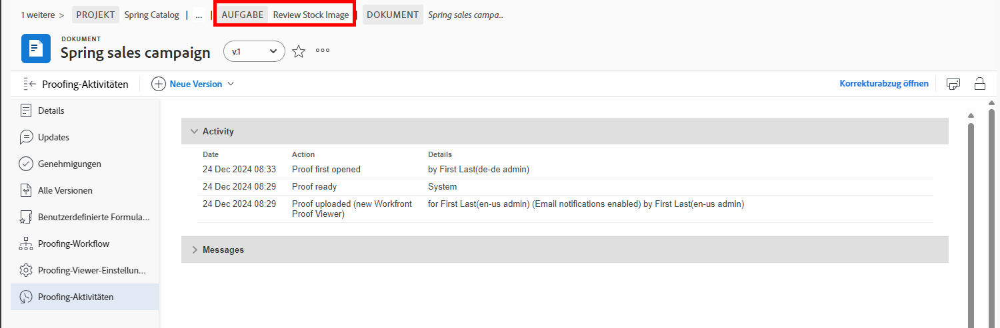

# Grundlegendes zu Korrekturabzugsdetails

## Anzeigen von Korrekturabzugsdetails

Als Managerin bzw. Manager oder Inhaberin bzw. Inhaber eines Korrekturabzugs können Sie über das Bedienfeld „Zusammenfassung“ und die Seite [!UICONTROL Dokumentdetails] weitere Informationen zu einem Korrekturabzug erhalten. Suchen Sie zunächst nach Ihrem Korrekturabzug im Abschnitt [!UICONTROL Dokumente] eines Projekts, einer Aufgabe oder eines Problems.

### Bedienfeld „Zusammenfassung“

Wählen Sie einen Korrekturabzug aus der Liste der Dokumente aus und klicken Sie dann auf das Symbol „Zusammenfassung“ oben rechts im Bildschirm.

![Ein Bild des Abschnitts [!UICONTROL Dokumente] eines Projekts mit ausgewähltem Korrekturabzug.](assets/document-summary-1.png)

Klicken Sie als Nächstes auf „Überblick“, um den Abschnitt „Überblick“ zu erweitern.

![Ein Bild des Abschnitts [!UICONTROL Dokumente] eines Projekts mit ausgewähltem Korrekturabzug und erweitertem Bedienfeld „Zusammenfassung“. Sowohl das Bedienfeld „Zusammenfassung“ als auch das Symbol für das Bedienfeld sind hervorgehoben.](assets/document-summary-2.png)

Scrollen Sie dann nach unten zum Abschnitt „Proofing“. Hier können Sie die verantwortliche Person für den Korrekturabzug, den Fortschritt, die Anzahl der Kommentare, den Status und das Fälligkeitsdatum sehen.

![Ein Bild des Abschnitts [!UICONTROL Dokumente] eines Projekts mit ausgewähltem Korrekturabzug und erweitertem Bedienfeld „Zusammenfassung“. Sowohl das Bedienfeld „Zusammenfassung“ als auch das Symbol für das Bedienfeld sind hervorgehoben.](assets/document-summary-3.png)

Hinweis: Der Abschnitt [!UICONTROL Genehmigungen] im Panel „Zusammenfassung“ ist für Genehmigungen von **Dokumenten** bestimmt und **nicht** an den Überprüfungs- und Genehmigungsprozess gebunden. Die beiden Prozesse sind in [!DNL Workfront] voneinander getrennt.

### [!UICONTROL Dokumentdetails]

Klicken Sie auf [!UICONTROL Dokumentdetails], um weitere Informationen über den Korrekturabzug zu erhalten.

![Ein Bild des Abschnitts [!UICONTROL Dokumente] eines Projekts mit ausgewähltem Korrekturabzug und hervorgehobener Option [!UICONTROL Dokumentdetails].](assets/document-summary-4.png)

Dadurch gelangen Sie zur Seite [!UICONTROL Dokumentdetails] und zu einer Vielzahl zusätzlicher Optionen im linken Panel.

![Ein Bild der Seite des Korrekturabzugs in [!DNL  Workfront].](assets/document-details.png)

Beachten Sie, dass die Möglichkeit, Informationen zum Proofing-Prozess zu sehen, von Ihren Proofing-Berechtigungen in [!DNL Workfront] abhängt.

Auf der Seite des Korrekturabzugs können Sie über das Menü des linken Panels auf diese Abschnitte zugreifen:

* **Aktualisierungen –** Kommentare aus dem Korrekturabzug-Viewer werden hier mit dem Tag „Korrekturabzugskommentar“ angezeigt. Sie können auch Kommentare zur Datei abgeben, genau wie Sie Kommentare zu einer Aufgabe oder einem Projekt abgeben (diese Kommentare erscheinen nicht im Korrekturabzug-Viewer).
* **Genehmigungen** – Dieser Abschnitt ist für Dokumentgenehmigungen und nicht für Proofing-Genehmigungen bestimmt. Die beiden Arten von Genehmigungen sind separate Prozesse in [!DNL Workfront] und sind nicht miteinander verknüpft. Wenn Sie Korrekturabzug-Workflows für Ihre Überprüfungen und Genehmigungen verwenden, verwenden Sie diesen Abschnitt nicht.
* **Alle Versionen** – Verfolgen und verwalten Sie den Versionsverlauf des Korrekturabzugs. Möglicherweise ist es einfacher für Sie, auf diese Informationen im Bedienfeld „Zusammenfassung“ der Liste [!UICONTROL Dokumente] zuzugreifen.
* **Benutzerdefinierte Formulare** – Benutzerdefinierte Formulare werden bei Korrekturabzügen verwendet, um unternehmensspezifische Informationen zu erfassen. Diese Informationen können mit der Datei an integrierte Dokumentenspeichersysteme wie [!DNL Workfront] DAM oder Adobe Experience Manager weitergegeben werden. Benutzerdefinierte Formulare werden von Ihren System- oder Gruppenadmins für [!DNL Workfront] eingerichtet. Sprechen Sie mit Ihrem Team oder Ihren Admins, um zu erfahren, ob Sie benutzerdefinierte Formulare für Korrekturabzüge verwenden werden.
* **Proofing-Workflow** – Verwalten oder ändern Sie den Workflow, der dem Korrekturabzug zugewiesen ist. Sie können dieses Fenster auch über den Link [!UICONTROL Proofing-Workflow] auf dem Korrekturabzug in der Liste [!UICONTROL Dokumente] öffnen.

Sehen wir uns zwei der Abschnitte genauer an: [!UICONTROL Proofing-Viewer-Einstellungen] und [!UICONTROL Proofing-Aktivität].

### [!UICONTROL Proofing-Viewer-Einstellungen]

Mithilfe dieser Einstellungen können Sie den Zugriff auf den Korrekturabzug selbst steuern.

![Ein Bild der [!UICONTROL Proofing-Viewer-Einstellungen] auf der Seite des Korrekturabzugs, mit Hervorhebung der Option [!UICONTROL Proofing-Viewer-Einstellungen] im Menü des linken Bedienfelds.](assets/proofing-settings-on-details-page.png)

* **[!UICONTROL Anmeldung erforderlich. Dieser Korrekturabzug kann nicht für Gastbenutzerinnen und Gastbenutzer freigegeben werden]** – Der Korrekturabzug kann nur für Personen freigegeben werden, die über eine [!DNL Workfront]-Proofing-Lizenz verfügen.
* **[!UICONTROL Entscheidungen müssen elektronisch signiert werden] –** Für die Freigabe eines Korrekturabzugs muss die Empfängerin bzw. der Empfänger über Proofing-Berechtigungen in [!DNL Workfront] verfügen und muss den Korrekturabzug „elektronisch signieren“, indem sie bzw. er bei einer Korrekturabzugs-Entscheidung das Proofing-Passwort eingibt. (Hinweis: Das Proofing-Passwort ist ein anderes als Ihr [!DNL Workfront]-Passwort. Das Proofing-Passwort ist nicht einfach zugänglich, daher kennen die meisten Empfängerinnen und Empfänger ihr Passwort nicht.) Adobe empfiehlt, mit Ihrer [!DNL Workfront]-Beraterin bzw. Ihrem -Berater zu sprechen, bevor Sie diese Funktion verwenden.
* **[!UICONTROL Korrekturabzug sperren, wenn alle erforderlichen Entscheidungen getroffen sind ]** – Auf diese Weise wird der Korrekturabzug für alle weiteren Kommentare, Antworten, Entscheidungen usw. gesperrt, sobald alle Entscheidungen zu dem Korrekturabzug getroffen sind. Dadurch wird die gesamte Korrekturabzugsversion gesperrt, nicht nur ein bestimmter Schritt des Proofing-Workflows.
* **[!UICONTROL Herunterladen der Originaldatei zulassen] –** Empfängerinnen und Empfänger des Korrekturabzugs können die ursprüngliche Quelldatei des Korrekturabzugs vom Proofing-Viewer herunterladen.
* **[!UICONTROL Freigabe des Korrekturabzugs über öffentliche URL oder Einbettungs-Code zulassen]** – Empfängerinnen und Empfänger eines Korrekturabzugs können für alle einen öffentlich zugänglichen Korrekturabzug-Link freigeben.
* **[!UICONTROL Abonnieren des Korrekturabzugs über öffentliche URL oder Einbettungs-Code zulassen] –** Alle, die die öffentliche URL erhalten, können sich mit E-Mail-Adresse und Name (falls es sich nicht um Benutzende des Korrekturabzugs handelt) bzw. mit E-Mail-Adresse und Proofing-Passwort (falls es sich um eine Benutzerin bzw. einen Benutzer des Proofing handelt) zum Korrekturabzug hinzufügen. (Hinweis: Das Proofing-Passwort ist ein anderes als das [!DNL Workfront]-Passwort.)

### [!UICONTROL Proofing-Aktivität]

Auf dieser Seite werden die gesamten Korrekturabzugsaktivitäten sowie die mit diesem Korrekturabzug gesendeten E-Mail-Nachrichten verfolgt.

![Ein Bild des Abschnitts [!UICONTROL Proofing-Aktivität] auf der Seite des Korrekturabzugs mit hervorgehobener [!UICONTROL Proofing-Aktivität] im Menü des linken Bedienfelds.](assets/proofing-activity-in-details.png)

Der Abschnitt **[!UICONTROL Aktivität]** gibt mit einem Zeitstempel an, wann Kommentare verfasst und Entscheidungen getroffen wurden. Zudem wird angegeben, von wem. Es wird auch verfolgt, wann die Schritte des Proofing-Workflows gestartet wurden, wann eine Empfängerin oder ein Empfänger den Korrekturabzug zum ersten Mal geöffnet hat und weitere Informationen, die im Zusammenhang mit Korrekturabzügen relevant sein können. Diese Details können hilfreich sein, wenn Sie Dinge herausfinden möchten, wie z. B. warum ein Schritt im Proofing-Workflow nie gestartet wurde.

Der Abschnitt **[!UICONTROL Nachrichten]** gibt mit einem Zeitstempel an, wann E-Mail-Warnhinweise und -Nachrichten an Empfängerinnen und Empfänger gesendet wurden, von wem sie gesendet wurden und was die Nachricht enthalten hat. Dies kann bei der Fehlerbehebung hilfreich sein, wenn jemand sagt, eine E-Mail über einen Korrekturabzug wäre nicht eingegangen. Sie können überprüfen, ob und wann eine E-Mail gesendet wurde.

Adobe empfiehlt Managern, Managerinnen und Verantwortlichen für Korrekturabzüge, sich mit den Informationen in diesen beiden Abschnitten vertraut zu machen. Wenn Sie diese Informationen mit den Kenntnissen kombinieren, wie Sie die [!UICONTROL SOCD]-Fortschrittsleiste lesen, können Sie Ihre Korrekturabzüge wirklich verstehen und verwalten, unabhängig davon, wo sie sich im Proofing-Workflow befinden.

Sobald Sie mit der Arbeit im Abschnitt [!UICONTROL Dokumentdetails] fertig sind, verwenden Sie den Breadcrumb-Pfad, um zum Abschnitt [!UICONTROL Dokumente] des Projekts, der Aufgabe oder des Problems zurückzukehren, dem/der der Korrekturabzug angefügt ist.

<!--
#### Learn more
* [!UICONTROL Document details] overview
* Add a custom form to a document
* Request document approvals
* Summary for documents overview
* View activity on a proof within [!DNL Workfront]
-->
