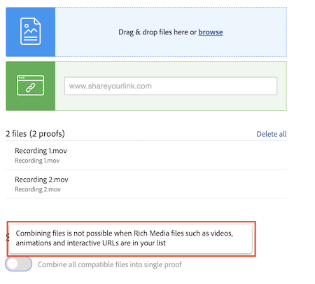

# Kombinieren mehrerer Dateien zu einem einzigen Korrekturabzug

Durch Zusammenfassen mehrerer Dateien in einem einzigen Korrekturabzug können Sie den Proofing-Prozess häufig rationalisieren.

Die Option „Kombinieren“ ist hilfreich, wenn einzelne Dateien zusammenhängen oder Teil einer vollständigen Aufgabe sind und alle Dateien von denselben Personen innerhalb derselben Frist geprüft werden müssen.

Beispiel: Das Kreativ-Team hat eine Broschüre entworfen. Vier Designerinnen und/oder Designer erstellten die Seiten und speicherten sie als einzelne PDF-Dateien. Würden sie diese jeweils als einzelnen Korrekturabzug hochladen, müssten die prüfenden Personen vier verschiedene Korrekturabzüge prüfen. Außerdem ließe sich schwerer überprüfen, ob die Teile der Broschüre zusammenpassen.

Lösung: Eine Person lädt alle PDFs hoch und fasst sie beim Hochladen zu einem einzigen Korrekturabzug zusammen. Dadurch können die prüfenden Personen die Broschüre als Ganzes sehen anstatt als separate Teile.

Um Korrekturabzüge zusammenzufassen:

1. Öffnen Sie den Abschnitt [!UICONTROL Dokumente] des Projekts, der Aufgabe oder des Problems, woran der Korrekturabzug angehängt werden soll.
2. Ziehen Sie die Dateien per Drag -and-Drop in den Upload-Bereich oder navigieren Sie dorthin. [!DNL Workfront] unterstützt die Kombination von bis zu 50 Dateien.
3. Aktivieren Sie die Option [!UICONTROL Alle kompatiblen Dateien zu einem einzigen Korrekturabzug zusammenfassen].
4. Geben Sie einen Namen für den kombinierten Korrekturabzug ein. Dies ist erforderlich.
5. Falls gewünscht, können Sie die Reihenfolge, in der die Dateien kombiniert werden sollen, per Drag-and-Drop in der Upload-Liste ändern.
6. Fügen Sie Empfängerinnen und Empfänger für Korrekturabzüge hinzu, setzen Sie eine Frist usw.
7. Klicken Sie auf [!UICONTROL Korrekturabzug erstellen], um den Upload abzuschließen.

![Ein Bild des Fensters [!UICONTROL Neuer Korrekturabzug], in dem die Liste der hochgeladenen Dateien und der Abschnitt [!UICONTROL Einzelner Korrekturabzug] hervorgehoben wurde.](assets/combine-proofs.png)

Sobald der Korrekturabzug hochgeladen wurde, wird er als ZIP-Datei auf der Registerkarte [!UICONTROL Dokumente] angezeigt.

Zur Anzeige der kombinierten Datei ist nichts weiter erforderlich. Klicken Sie einfach wie gewohnt auf [!UICONTROL Korrekturabzug öffnen], um den Korrekturabzug im Viewer zu öffnen.

## Können Videodateien kombiniert werden?

Leider ist es nicht möglich, Dateien zu kombinieren, wenn Rich-Media-Dateien wie Videos, Animationen und interaktive URLs in Ihrer Liste enthalten sind.

## Sie sind dran

>[!IMPORTANT]
>
>Vergessen Sie nicht, Ihre Mitarbeitenden daran zu erinnern, Ihnen im Rahmen Ihrer Workfront-Schulung einen Korrekturabzug zu schicken.

Suchen Sie drei oder vier Dateien (PDF, Textdatei, usw.) auf Ihrem Computer.

1. Öffnen Sie ein Projekt, eine Aufgabe oder ein Problem, das Sie für praktische Übungen in Workfront verwenden.
1. Laden Sie die Dateien hoch und kombinieren Sie sie in einem einzigen Korrekturabzug.
1. Passen Sie die Reihenfolge der Dateien an, indem Sie die letzte Datei in der Liste an den Anfang der Liste setzen.
1. Weisen Sie den Workflow Ihrer Wahl zu (einfach oder automatisch) und schließen Sie den Upload ab.

<!--
##Learn more
* Create a multi-page proof
-->
